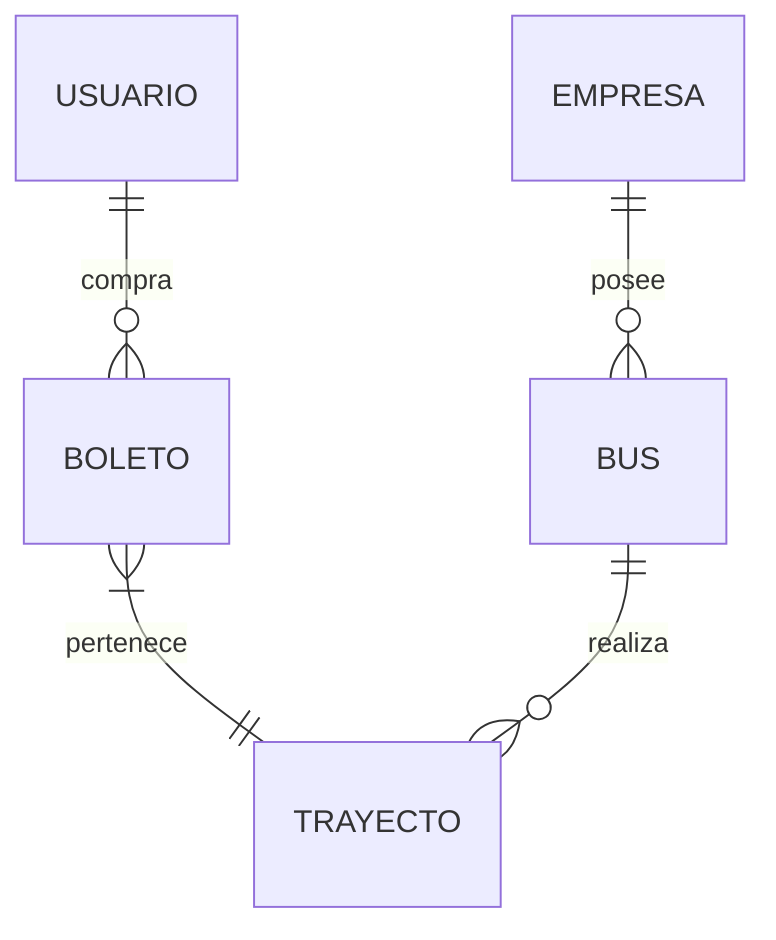

# Diagrama Entidad-Relación (ERD)

```mermaid
erDiagram
    USUARIO ||--o{ BOLETO : "compra"
    BOLETO }|--|| TRAYECTO : "pertenece"
    EMPRESA ||--o{ BUS : "posee"
    BUS ||--o{ TRAYECTO : "realiza"
```

> _Nota: Este diagrama es generado/actualizado mediante introspección de base de datos o análisis de entidades._
