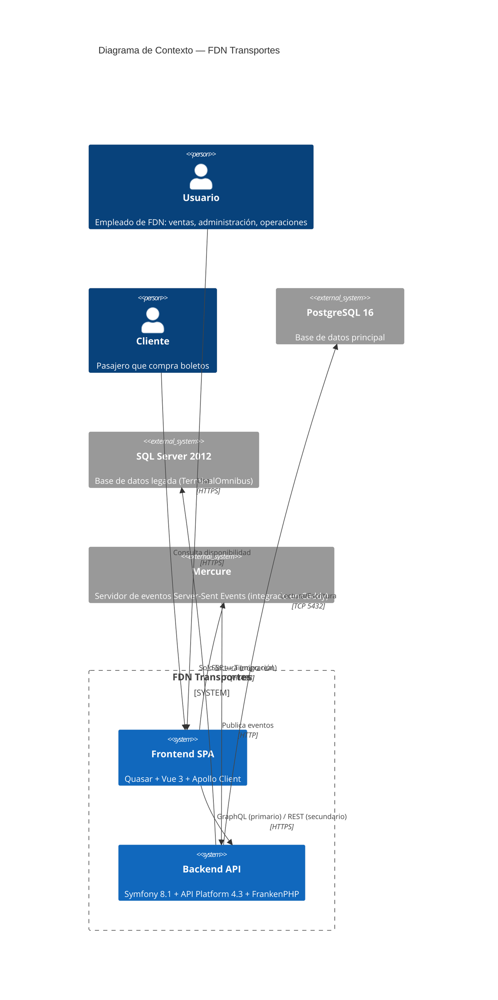
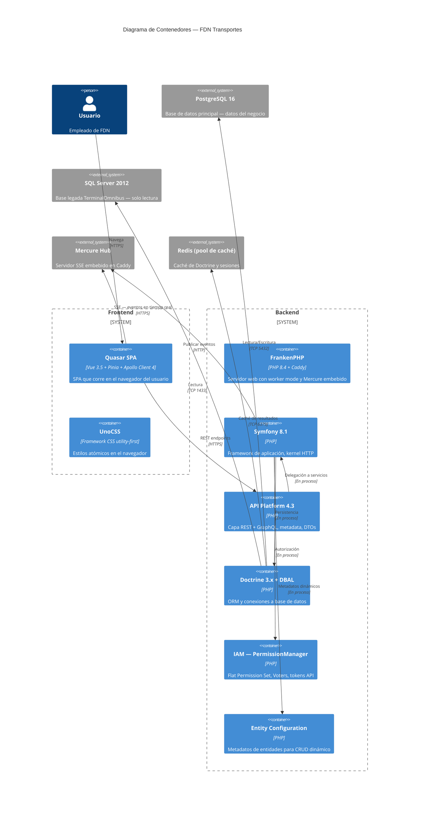
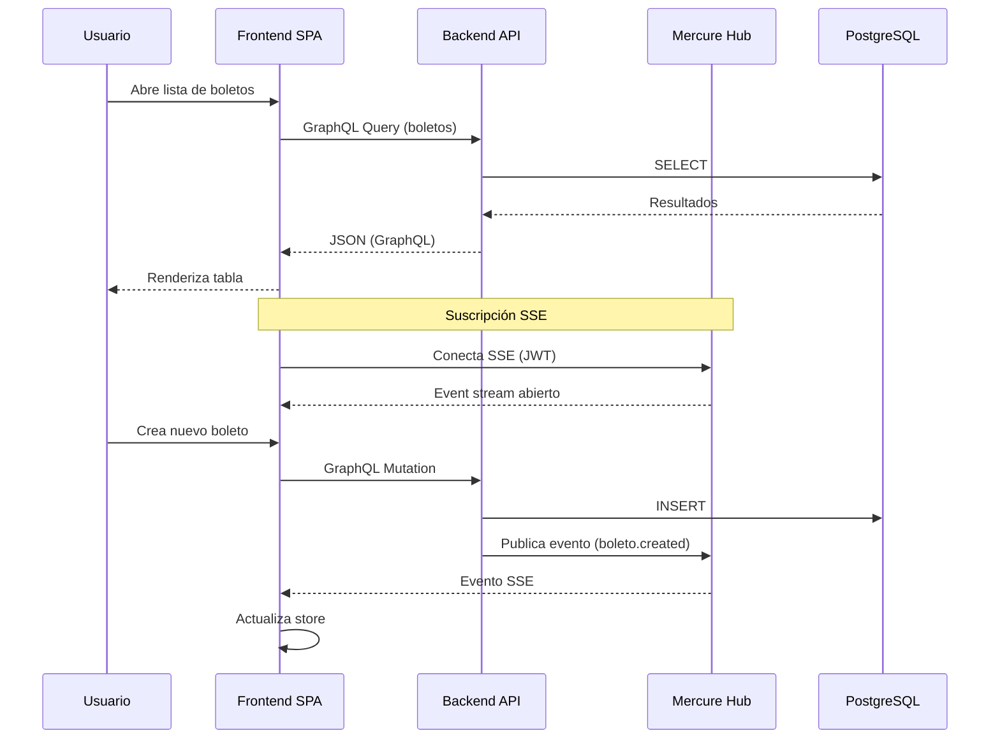

# Arquitectura del Sistema — FDN Transportes

## Vista Contexto (C4 — Nivel 1)



## Vista Contenedores (C4 — Nivel 2)



## Descripción del Sistema

**FDN Transportes** es un sistema de gestión de transporte terrestre de pasajeros construido como un monorepo con backend Symfony y frontend Quasar SPA. El sistema maneja la venta de boletos, administración de flota de autobuses, gestión de personal, rutas, horarios y estaciones para la empresa Transportes Fuentes del Norte.

### Dominios funcionales

| Subdominio | Descripción |
|---|---|
| **Transporte** | Rutas, trayectos, recorridos, horarios |
| **Flota** | Autobuses, marcas, asientos, mantenimiento |
| **Venta** | Boletos, ventas, facturación, clientes |
| **Personal** | Pilotos, usuarios, roles, permisos |
| **Configuración** | Empresas, localidades, moneda, tarifas |
| **Infraestructura** | Estaciones, paradas, enclaves |
| **Seguridad** | IAM, autenticación, tokens API |

## Decisiones Tecnológicas

| Decisión | Opción | Razón |
|---|---|---|
| Lenguaje backend | PHP 8.4 | Madurez, ecosistema Symfony, costo operativo |
| Framework | Symfony 8.1 | Estándar empresarial, bundles, comunidad |
| API | API Platform 4.3 | REST + GraphQL desde una misma configuración |
| ORM | Doctrine 3.x | Mapping robusto, soporte multi-EM |
| BD principal | PostgreSQL 16 | Licencia libre, rendimiento, extensiones |
| BD legada | SQL Server 2012 | Sistema heredado TerminalOmnibus |
| Frontend | Quasar 2 + Vue 3.5 | Framework completo, componentes Material |
| Estado | Pinia 3 | Tipado, devtools, simplicidad |
| GraphQL client | Apollo Client 4 | Caching, subscriptions, ecosistema |
| Estilos | UnoCSS | Utility-first, zero-config, rápido |
| Tiempo real | Mercure | SSE sobre Caddy, JWT, integración Symfony |
| Contenedores | Docker Compose | 3 servicios, entornos dev/prod |
| Servidor web | FrankenPHP | PHP embebido en Caddy, worker mode, Mercure nativo |

## Patrones de Comunicación

### GraphQL (primario)

El frontend se comunica con el backend mediante GraphQL como capa principal. Esto permite:

- Consultas exactas con solo los campos necesarios
- Múltiples recursos en una sola petición
- Mutaciones con tipo seguro (type-safe)
- Subscripciones vía Mercure para tiempo real

```graphql
query GetBoleto($id: ID!) {
  boleto(id: $id) {
    id
    cliente { nombre }
    asiento { numero clase }
    recorrido {
      nombre
      trayecto { origen { nombre } destino { nombre } }
    }
  }
}
```

### REST (secundario)

Endpoints REST se usan para:

- Autenticación (`POST /api/login`, `/api/logout`, `/api/auth/refresh`)
- Upload de archivos
- Endpoints de administración (cambiar password, conteos)
- Exposición de metadatos de configuración de entidades

### Server-Sent Events (Mercure)

Mercure proporciona actualizaciones en tiempo real:

- **Listas**: cuando un recurso se crea/modifica/elimina, la lista se actualiza automáticamente
- **Items**: cambios en detalle de entidades específicas
- **Notificaciones**: eventos del sistema visibles al usuario


