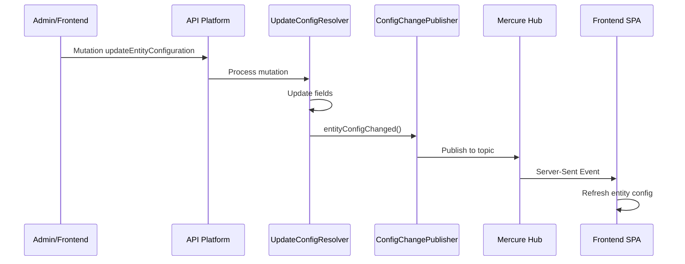

# Mercure Hub

## Configuración

Archivo: `config/packages/mercure.yaml`

```yaml
mercure:
    hubs:
        default:
            url: '%env(default::MERCURE_URL)%'
            public_url: '%env(default::MERCURE_PUBLIC_URL)%'
            jwt:
                secret: '%env(MERCURE_JWT_SECRET)%'
                publish: '*'
```

El hub de Mercure permite publicar actualizaciones en tiempo real a los clientes conectados.

## Servicio publicador

Ubicación: `src/Services/ConfigChangePublisher.php`

```php
final class ConfigChangePublisher {
    public function __construct(
        private readonly HubInterface $hub
    ) {}

    public function entityConfigChanged(EntityConfiguration $entityClass): void {
        $this->hub->publish(new Update(
            'entity_configuration',
            json_encode([
                'entityClass' => $entityClass->getEntityClass(),
                'action' => 'updated',
                'updatedAt' => $entityClass->getUpdatedAt()->format('c')
            ])
        ));
    }

    public function graphqlSchemaChanged(): void {
        $this->hub->publish(new Update(
            'graphql_schema',
            json_encode(['action' => 'changed'])
        ));
    }
}
```

## Topics (temas)

| Topic | Propósito | Disparado por |
|-------|-----------|---------------|
| `entity_configuration` | Notifica cambios en configuración de entidades | `EntityConfigSynchronizer` al sincronizar, `UpdateEntityConfigurationFieldsResolver` al actualizar campos |
| `graphql_schema` | Notifica cambios en el schema GraphQL | Llamado explícito cuando la configuración de entidades cambia |

## Flujo de publicación



## Suscripción desde el frontend

El frontend se suscribe vía EventSource nativo. Ejemplo conceptual:

```javascript
const url = new URL('https://mercure.example.com/.well-known/mercure');
url.searchParams.append('topic', 'entity_configuration');
const eventSource = new EventSource(url);

eventSource.onmessage = event => {
    const data = JSON.parse(event.data);
    // Refrescar configuración de la entidad
};
```

## JWT

- El secret se configura via `MERCURE_JWT_SECRET`
- El publisher usa `publish: '*'` para permitir publicación en cualquier topic
- Los subscribers deben tener un JWT válido con los topics a los que se suscriben

## Integración con API Platform

La integración con API Platform está habilitada:

```yaml
mercure:
    include_type: true
```

Esto permite que los recursos de API Platform incluyan automáticamente el enlace Mercure en sus respuestas JSON-LD.
