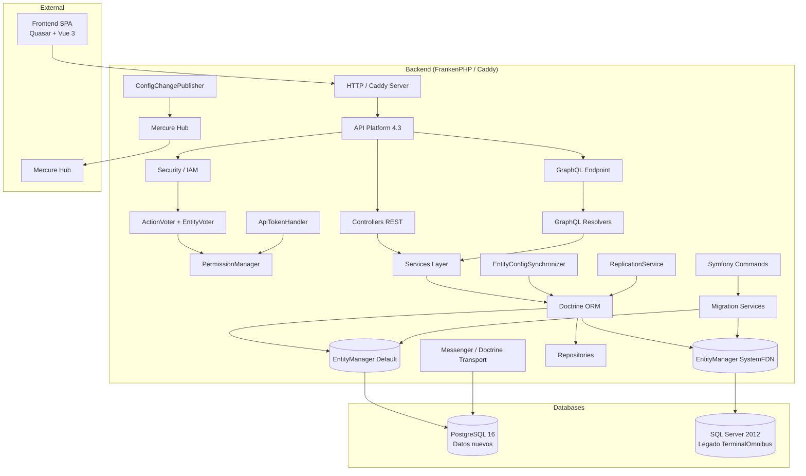
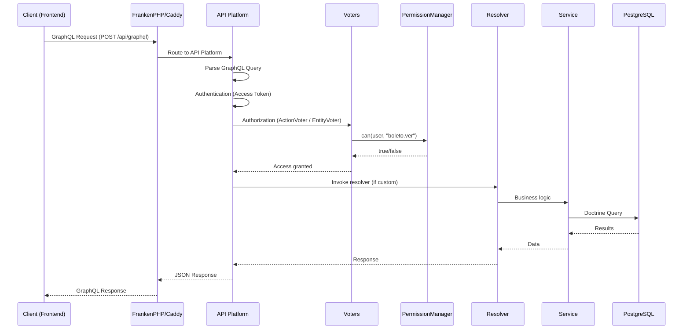

# Arquitectura del Backend

## Diagrama de Componentes C4

El backend de FDN Transportes sigue una arquitectura hexagonal simplificada sobre Symfony 8.1. A continuación se describe el diagrama de componentes a nivel de contenedor (C4).

## Capas de la aplicación

| Capa | Directorio | Responsabilidad |
|------|-----------|-----------------|
| **Controllers** | `src/Controller/` | Puntos finales REST personalizados (login, permissions, cambio password, listado usuarios, conteos entidades) |
| **Commands** | `src/Command/` | Comandos Symfony para migración, sincronización, reset de BD y utilidades |
| **Services** | `src/Services/` | Lógica de negocio (collection helpers, cambio de divisas, password hasher, sincronización config, eventos SSE, publicador Mercure) |
| **Repository** | `src/Repository/` | Acceso a datos por entidad (21 repositorios) |
| **Voters** | `src/Security/Voter/` | `ActionVoter` y `EntityVoter` — decisión de autorización granular |
| **Resolvers** | `src/Resolver/` | Resolvedores GraphQL (CollectionResolver, UserByUsername, UpdateEntityConfigurationFields) |
| **Migration** | `src/Migration/` | Pipeline de migración desde TerminalOmnibus (Limpiador → Mapeador → Migrador) |
| **ApiResource** | `src/ApiResource/` | DTOs y clases utilitarias para API Platform |
| **DTO** | `src/DTO/` | Data Transfer Objects para GraphQL (CollectionDTO, DeleteMultipleDTO, MetadataDTO, EntityConfigurationDto) |
| **Entity** | `src/Entity/` | 24 entidades del dominio mapeadas a PostgreSQL |
| **EntitySistemaFdn** | `src/EntitySistemaFdn/` | 112 entidades legacy mapeadas a SQL Server (solo lectura) |
| **Filter** | `src/Filter/` | Filtros personalizados para API Platform (OrFilter, IdPartialSearchFilter) |
| **GraphQL** | `src/GraphQL/Type/` | Tipos GraphQL personalizados (DateType, MultipleType) |
| **Security** | `src/Security/` | IAM completo (PermissionManager, ApiTokenHandler, ExpressionProvider, LegacyPasswordHasher) |
| **Doctrine** | `src/Doctrine/` | Driver DBLib personalizado para SQL Server, función CAST para DQL |

## Flujo de una petición GraphQL típica

## Entidades principales (24)

Distribuidas en 7 subdominios:

| Subdominio | Entidades |
|-----------|-----------|
| **Transporte** | Boleto, Trayecto, Recorrido, RecorridoMatrioska, Servicio, Status |
| **Flota** | Bus, BusMarca, Asiento, Piloto, Enclave |
| **Venta** | Venta, Factura, Cliente, Boleto, Servicio |
| **Personal** | Usuario, Piloto |
| **Configuración** | EntityConfiguration, CollectionFieldConfig, FormFieldConfig |
| **Infraestructura** | Icon, IconCategory, Empresa, Localidad, Estacion, Parada, Nacion |
| **Seguridad** | Usuario, Role, Permiso, Action, ApiToken |
