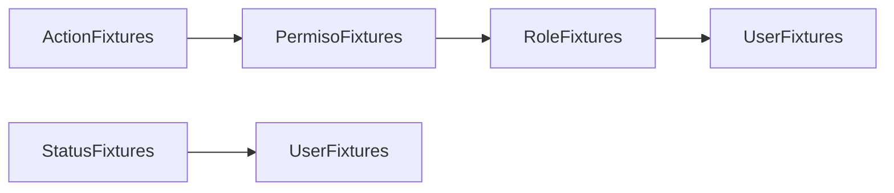

# Fixtures de datos

Los fixtures proporcionan datos de prueba para entornos de desarrollo y testing. Se definen en `src/DataFixtures/` y usan `DoctrineFixturesBundle`.

## Carga de fixtures

```bash
docker compose exec backend php bin/console doctrine:fixtures:load --append --no-interaction
```

## Orden de carga



## ActionFixtures

Archivo: `src/DataFixtures/ActionFixtures.php`

Define 30 acciones base del sistema, agrupadas por recurso:

| Recurso | Acciones |
|---------|----------|
| Usuario | listar, crear, editar, eliminar, ver |
| Rol | listar, crear, editar, eliminar, ver |
| Permiso | listar, crear, editar, eliminar, ver |
| Acción | listar, crear, editar, eliminar, ver |
| Boleto | listar, crear, editar, eliminar, anular, ver |
| Ruta | listar, crear, editar, eliminar, ver |

## PermisoFixtures

Archivo: `src/DataFixtures/PermisoFixtures.php`

Define 6 permisos, cada uno agrupando acciones relacionadas:

| Permiso | Acciones |
|---------|----------|
| Gestion Usuarios | usuario.* |
| Gestion Roles | rol.* |
| Gestion Permisos | permiso.* |
| Gestion Acciones | action.* |
| Gestion Boletos | boleto.* |
| Gestion Rutas | ruta.* |

## RoleFixtures

Archivo: `src/DataFixtures/RoleFixtures.php`

Define 4 roles con sus permisos asignados:

| Role | Permisos |
|------|----------|
| ROLE_SUPER_ADMIN | Gestion Usuarios, Roles, Permisos, Acciones, Boletos, Rutas |
| ROLE_ADMIN | Gestion Usuarios, Roles, Boletos, Rutas |
| ROLE_OPERADOR | Gestion Boletos |
| ROLE_CONSULTA | (ninguno) |

## UserFixtures

Archivo: `src/DataFixtures/UserFixtures.php`

Define 4 usuarios de prueba:

| Usuario | Password | Roles | Permisos directos | Acciones directas | Acciones denegadas |
|---------|----------|-------|-------------------|-------------------|-------------------|
| superadmin | super123 | ROLE_SUPER_ADMIN | — | — | — |
| admin | admin123 | ROLE_ADMIN | Gestion Acciones | — | — |
| operador | operador123 | ROLE_OPERADOR | — | usuario.ver | — |
| consulta | consulta123 | ROLE_CONSULTA | Gestion Boletos | — | boleto.anular |

Cada usuario se crea con un `ApiToken` activo para autenticación inmediata.

## StatusFixtures

Archivo: `src/DataFixtures/StatusFixtures.php`

Define un único status: `Activo`. Referenciado por entidades que usan `StatusTrait`.
