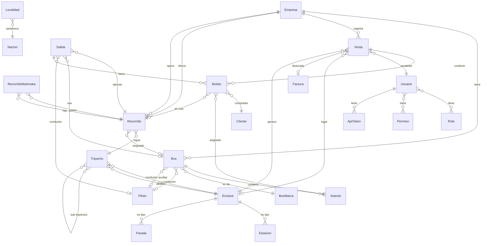

# Base de datos

## PostgreSQL 16

La base de datos principal del sistema FDN Transportes es PostgreSQL 16, que almacena todas las entidades del dominio modelo-transporte.

## Schema general



## Convenciones de nomenclatura

| Convención | Descripción |
|-----------|-------------|
| `snake_case` | Nombres de tablas y columnas |
| `id` | Primary key (serial/int) en todas las entidades |
| `legacy_id` | Columna opcional para ID del sistema legacy (string) |
| `created_at` / `updated_at` | Timestamps de auditoría |
| `nombre` | Nombre descriptivo de la entidad |

## Tipos de datos utilizados

| Tipo PostgreSQL | Uso |
|----------------|-----|
| `integer` / `serial` | IDs autoincrementales |
| `varchar(255)` | Texto corto (nombres, descripciones) |
| `varchar(50)` | Códigos, matrículas, teléfonos |
| `varchar(20)` | NIT, códigos cortos |
| `text` | Descripciones largas |
| `decimal(10,2)` | Montos monetarios |
| `decimal(10,7)` | Coordenadas (latitud/longitud) |
| `date` | Fechas (sin hora) |
| `datetime` / `timestamp` | Fechas con hora |
| `datetime_immutable` | Timestamps inmutables |
| `boolean` | Flags activo/inactivo |
| `json` | Datos estructurados (tags, attrs) |
| `uuid` | Identificadores UUID (Factura) |

## Entidades del dominio (24)

Agrupadas por subdominio:

| Subdominio | Tablas |
|-----------|--------|
| Transporte | `boleto`, `trayecto`, `recorrido`, `recorrido_matrioska`, `salida`, `status` |
| Flota | `bus`, `bus_marca`, `asiento`, `piloto`, `enclave` |
| Venta | `venta`, `factura`, `cliente` |
| Personal | `usuario`, `piloto` |
| Configuración | `entity_configuration`, `collection_field_config`, `form_field_config` |
| Infraestructura | `icon`, `icon_category`, `empresa`, `localidad`, `nacion` (tabla `pais`) |
| Seguridad | `usuario`, `role`, `permiso`, `action`, `api_token`, `user_role`, `role_permiso`, `permiso_action`, `user_direct_action`, `user_denied_action` |

## Herencia con Single Table Inheritance

`Enclave` usa STI de Doctrine:

```php
#[ORM\Entity]
#[ORM\InheritanceType('SINGLE_TABLE')]
#[ORM\DiscriminatorColumn(name: 'tipo', type: 'string')]
#[ORM\DiscriminatorMap(['enclave' => 'Enclave', 'estacion' => 'Estacion', 'parada' => 'Parada'])]
class Enclave extends Base { ... }
```

Todas las estaciones y paradas se almacenan en la tabla `enclave`, diferenciadas por la columna `tipo`.
