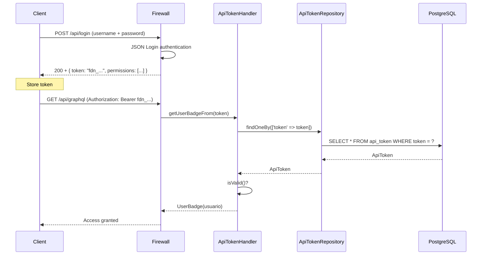

# API Tokens

## ApiToken entity

Archivo: `src/Entity/ApiToken.php`

Los API Tokens permiten autenticación stateless. Cada token está asociado a un usuario y puede tener expiración.

### Estructura

```php
class ApiToken extends Base {
    private const PERSONAL_ACCESS_TOKEN_PREFIX = 'fdn_';

    #[ORM\ManyToOne(inversedBy: 'apiTokens')]
    #[ORM\JoinColumn(nullable: false, onDelete: 'cascade')]
    private ?Usuario $usuario = null;

    #[ORM\Column(type: Types::DATETIME_MUTABLE, nullable: true)]
    private ?\DateTimeInterface $expira = null;

    #[ORM\Column(length: 68)]
    private string $token;

    #[ORM\Column(nullable: true)]
    private ?bool $activo = null;
}
```

### Generación de tokens

```php
public function __construct(string $tokenType = self::PERSONAL_ACCESS_TOKEN_PREFIX) {
    $this->token = $tokenType . bin2hex(random_bytes(32));
}
```

Los tokens se generan con:
- Prefijo `fdn_`
- 64 caracteres hex aleatorios (32 bytes)
- Longitud total: 68 caracteres

### Validación

Un token es válido si:
- `activo` es `true`
- No ha expirado (si `expira` está definido)

```php
public function isValid(): ?bool {
    return $this->activo;
}
```

## ApiTokenHandler

Archivo: `src/Security/ApiTokenHandler.php`

Implementa `AccessTokenHandlerInterface` de Symfony para manejar autenticación via Access Token:

```php
class ApiTokenHandler implements AccessTokenHandlerInterface {
    public function __construct(private ApiTokenRepository $apiTokenRepository) {}

    public function getUserBadgeFrom(string $accessToken): UserBadge {
        $token = $this->apiTokenRepository->findOneBy(['token' => $accessToken]);
        if (!$token) throw new BadCredentialsException();
        if (!$token->isValid()) {
            throw new CustomUserMessageAuthenticationException('La sessión a caducado.');
        }
        return new UserBadge(
            $token->getUsuario()->getUserIdentifier(),
            fn() => $token->getUsuario()
        );
    }
}
```

## Flujo de autenticación



## Endpoints de autenticación

| Endpoint | Método | Propósito |
|----------|--------|-----------|
| `/api/login` | POST | Autenticación con username/password. Devuelve token y permisos. |
| `/auth` | POST | Verifica si el usuario actual está autenticado. Devuelve token. |
| `/user-invalid` | GET | Invalida el token del usuario (logout). |
| `/api/me/permissions` | GET | Devuelve las acciones efectivas del usuario autenticado. |

### Login response

```json
{
    "token": "fdn_a1b2c3d4e5f6...",
    "username": "admin",
    "uri": "/api/users/1",
    "permissions": ["boleto.ver", "boleto.crear", ...]
}
```

## Configuración del firewall

En `config/packages/security.yaml`:

```yaml
firewalls:
    main:
        lazy: true
        provider: app_user_provider
        json_login:
            check_path: /api/login
            username_path: username
            password_path: password
        access_token:
            token_handler: App\Security\ApiTokenHandler
```

## Consideraciones de seguridad

1. Los tokens se almacenan en texto claro en la base de datos (hash no requerido porque son tokens de acceso bearer)
2. Prefijo `fdn_` permite identificar tokens del sistema visualmente
3. Se puede invalidar un token desactivándolo (`activo = false`) sin eliminar el registro
4. La expiración opcional permite tokens con vigencia limitada
