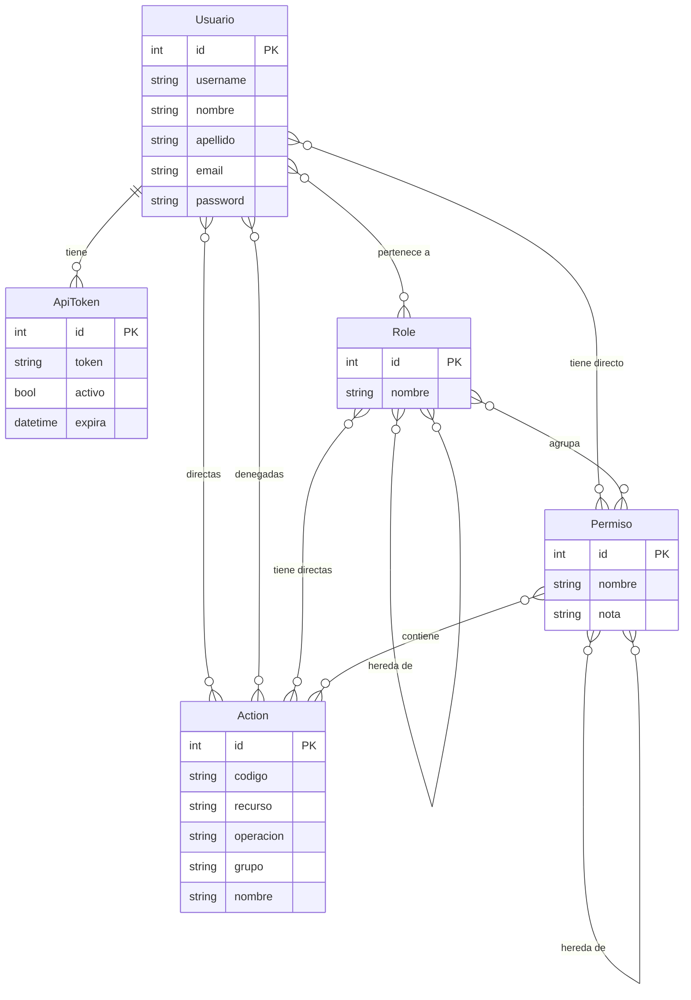
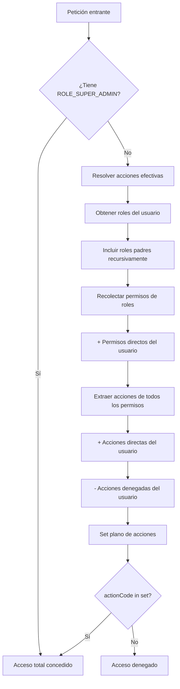

# IAM — Identity & Access Management

## Flat Permission Set

El sistema IAM de FDN implementa un modelo de **Flat Permission Set** (conjunto plano de permisos), donde todos los permisos de un usuario se resuelven en una lista plana de códigos de acción. No hay herencia compleja ni ACLs: cada usuario tiene un conjunto efectivo de acciones que puede realizar.

## Arquitectura del modelo



## Entidades del modelo

| Entidad | Archivo | Propósito |
|---------|---------|-----------|
| `Usuario` | `src/Entity/Usuario.php` | Usuario del sistema, con credenciales y asignaciones |
| `Role` | `src/Entity/Role.php` | Rol jerárquico que agrupa permisos |
| `Permiso` | `src/Entity/Permiso.php` | Grupo de acciones relacionadas (permiso lógico) |
| `Action` | `src/Entity/Action.php` | Acción atómica con código único (e.g. `boleto.ver`) |
| `ApiToken` | `src/Entity/ApiToken.php` | Token de acceso para autenticación stateless |

## Flujo de autorización



## Jerarquía de roles Symfony

Definida en `config/packages/security.yaml`:

```yaml
role_hierarchy:
    ROLE_SUPER_ADMIN: [ROLE_ADMIN]
    ROLE_ADMIN: [ROLE_OPERADOR, ROLE_USER]
    ROLE_OPERADOR: [ROLE_CONSULTA, ROLE_USER]
    ROLE_CONSULTA: [ROLE_USER]
```

## Evaluación de permisos

El `PermissionManager` (en `src/Security/PermissionManager.php`) sigue este orden:

1. **Roles del usuario** (incluyendo padres jerárquicos recursivamente)
2. **Permisos de los roles** → extrae todas las acciones de cada permiso
3. **Permisos directos del usuario** (bypass de roles)
4. **Acciones directas del usuario** (grants individuales)
5. **Acciones denegadas** (revocaciones individuales,优先级 más alta)

El resultado es un `array<string, bool>` cacheado en memoria por usuario.

## Ejemplo de resolución

Un usuario con:
- Role: `ROLE_OPERADOR` (que tiene permiso "Gestion Acciones")
- Permiso directo: ninguno
- Acción directa: `usuario.ver`
- Acción denegada: `boleto.anular`

Acciones efectivas: todas las acciones de "Gestion Acciones" + `usuario.ver` - `boleto.anular`
