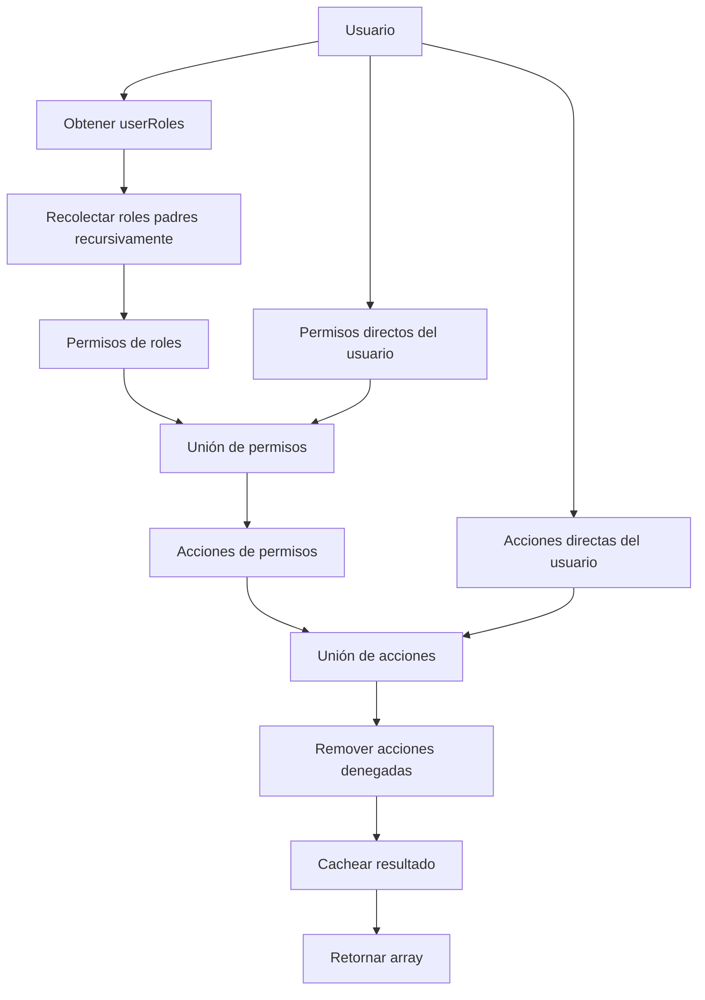

# PermissionManager

Archivo: `src/Security/PermissionManager.php`

El PermissionManager es el servicio central que resuelve el conjunto plano de acciones permitidas para un usuario. Es inyectado en ambos voters y utilizado por los controllers para consultar permisos.

## Métodos principales

| Método | Descripción |
|--------|-------------|
| `getEffectiveActions(Usuario $user): array` | Devuelve todos los códigos de acción permitidos para el usuario |
| `can(Usuario $user, string $actionCode): bool` | Verifica si el usuario tiene una acción específica |
| `canAny(Usuario $user, array $actionCodes): bool` | Verifica si el usuario tiene al menos una de las acciones |
| `canAll(Usuario $user, array $actionCodes): bool` | Verifica si el usuario tiene todas las acciones |
| `invalidateCache(Usuario $user): void` | Invalida el cache de acciones del usuario |

## Algoritmo de resolución



## Cache

El PermissionManager implementa un cache en memoria (array) para evitar recalcular las acciones en cada petición:

```php
private array $actionCache = [];

public function getEffectiveActions(Usuario $user): array {
    $userId = $user->getId();
    if (isset($this->actionCache[$userId])) {
        return array_keys($this->actionCache[$userId]);
    }
    // ... cálculo ...
    $this->actionCache[$userId] = $actions;
    return array_keys($actions);
}
```

El cache se invalida cuando:
- Se modifican los roles del usuario
- Se modifican los permisos del usuario
- Se modifican las acciones directas o denegadas
- Se llama explícitamente a `invalidateCache()`

## Resolución de jerarquía de roles

Los roles en el sistema FDN tienen jerarquía propia (diferente a la jerarquía de Symfony). Un rol puede tener roles padres:

```php
private function getAllParentRoles(Collection $roles): Collection {
    $all = new ArrayCollection();
    foreach ($roles as $role) {
        $this->collectRoleWithParents($role, $all);
    }
    return $all;
}

private function collectRoleWithParents(Role $role, ArrayCollection $collection): void {
    if ($collection->contains($role)) return;
    $collection->add($role);
    foreach ($role->getParents() as $parent) {
        $this->collectRoleWithParents($parent, $collection);
    }
}
```

## Ejemplo completo

```php
$user = $this->getUser(); // Usuario autenticado

// Verificar acción específica
if ($permissionManager->can($user, 'boleto.crear')) {
    // Crear boleto
}

// Verificar múltiples acciones (AND)
if ($permissionManager->canAll($user, ['boleto.ver', 'boleto.editar'])) {
    // Puede ver y editar boletos
}

// Verificar múltiples acciones (OR)
if ($permissionManager->canAny($user, ['boleto.anular', 'boleto.eliminar'])) {
    // Puede anular o eliminar boletos
}

// Obtener todas las acciones (para frontend)
$actions = $permissionManager->getEffectiveActions($user);
```

## Uso en controllers

El endpoint `/api/me/permissions` (en `src/Controller/PermissionController.php`) expone las acciones del usuario autenticado al frontend:

```php
public function __invoke(
    #[CurrentUser] ?Usuario $user,
    $permissionManager,
): JsonResponse {
    return $this->json([
        'actions' => $permissionManager->getEffectiveActions($user),
    ]);
}
```

Esto permite que el frontend conozca exactamente qué acciones puede realizar el usuario y adapte la UI dinámicamente.
