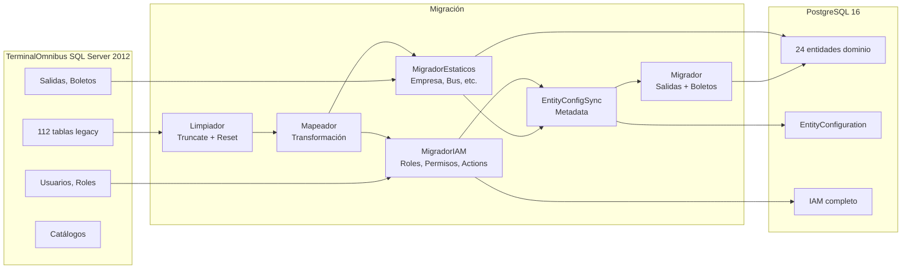

# Migración desde TerminalOmnibus

## Visión general

La migración transporta datos desde el sistema legacy TerminalOmnibus (Symfony 2.2 + SQL Server 2012) al nuevo sistema FDN (Symfony 8.1 + PostgreSQL 16).

## Pipeline de migración



## Estrategia de mapeo de IDs

| Tipo | Tablas | Estrategia |
|------|--------|------------|
| **ID_MAP** | empresa, enclave, asiento, cliente, usuario, tarifa | Usan el PK numérico legacy como nuevo PK. Sin columna `legacy_id`. |
| **LEGACY_MAP** | bus, trayecto, salida, boleto | El PK legacy es string o variable. Mantienen columna `legacy_id`. Nuevo PK autoincremental. |

## Clases del pipeline

| Clase | Archivo | Función |
|-------|---------|---------|
| `Limpiador` | `src/Migration/Limpiador.php` | Trunca todas las tablas y resetea secuencias |
| `Mapeador` | `src/Migration/Mapeador.php` | Transforma registros legacy al formato nuevo |
| `MigradorEstaticos` | `src/Migration/MigradorEstaticos.php` | Migra entidades estáticas (empresa, bus, cliente, piloto, marcas, localidad, trayectos, tarifas) |
| `MigradorIAM` | `src/Migration/MigradorIAM.php` | Crea Actions base, Permisos, Roles y asigna usuarios |
| `Migrador` | `src/Migration/Migrador.php` | Migra salidas y boletos. Es el paso transaccional más pesado. |

## Orden de migración

1. Clean (opcional) — truncar tablas nuevas
2. Datos estáticos — Empresa → Piloto → Localidad → Estacion → Cliente → Usuario → BusMarca → Bus → Asiento → Trayecto
3. IAM — Actions base → Permisos → Roles base → Roles legacy → User-Role
4. EntityConfiguration — sincronización de metadatos
5. Salidas + Boletos — desde salidas legacy

## Manejo de encoding

Los datos legacy vienen en ISO-8859-1 (Latin-1). El Mapeador convierte a UTF-8:

```php
private function sanitizeUtf8(array $row): array {
    $clean = [];
    foreach ($row as $k => $v) {
        $clean[$k] = is_string($v) ? mb_convert_encoding($v, 'UTF-8', 'ISO-8859-1') : $v;
    }
    return $clean;
}
```

## Conexión legacy

Se usa un objeto `\PDO` directo con DSN DBLib inyectado via `#[Target('oldPdo')]`:

```yaml
PDO $oldPdo:
    class: \PDO
    arguments:
        $dsn: "dblib:host=%env(systemfdn_host)%:%env(systemfdn_port)%;dbname=%env(systemfdn_dbname)%"
```
