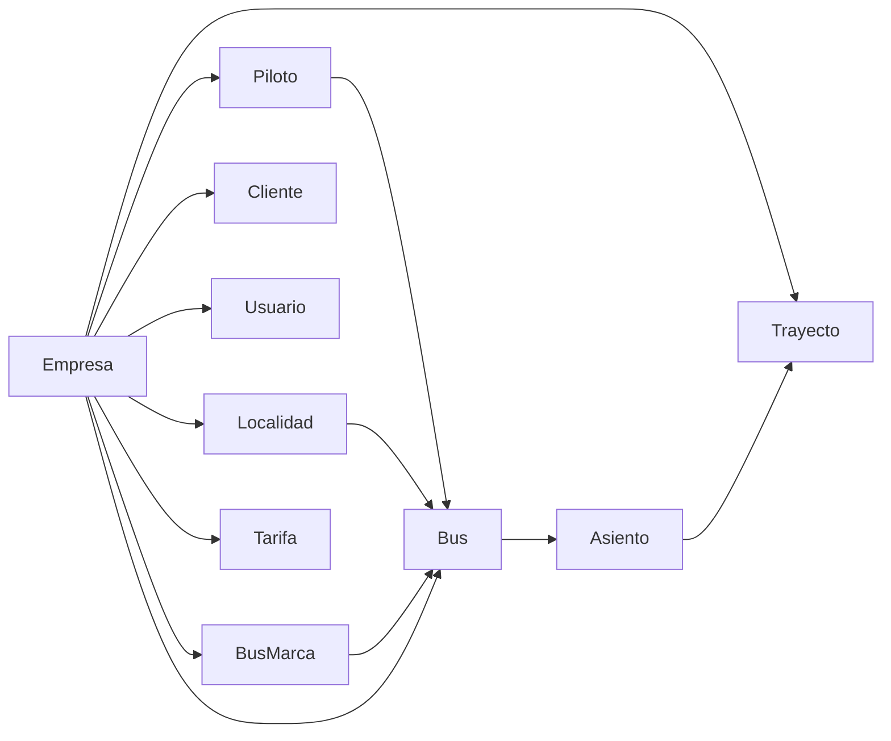

# Migración de entidades estáticas

Archivo: `src/Migration/MigradorEstaticos.php`

## Visión general

Migra entidades que no crecen en el tiempo (catálogos, configuraciones). Se ejecutan en orden específico debido a dependencias FK.

## Orden de migración



## Detalle por entidad

### Empresa

```sql
INSERT INTO empresa (id, nombre, nit, direccion, telefono, email)
VALUES (:id, :nombre, :nit, :direccion, :telefono, :email)
```

- PK legacy se reusa como nuevo PK
- Solo empresas activas (`activo = 1`)

### Piloto

```sql
INSERT INTO piloto (id, nombre, apellido, fechaNacimiento, telefono, codigo, ...)
```

- PK legacy reusado
- Campos mapeados desde las columnas legacy

### Localidad

- Origen: tabla `departamento` del legacy
- PK legacy reusado
- Tabla opcional (puede no existir en todas las instancias legacy)

### Estacion → Enclave

Las estaciones legacy se migran a la tabla `enclave` con tipo `'estacion'`:

```sql
INSERT INTO enclave (id, tipo, nombre, direccion, latitud, longitud)
VALUES (:id, 'estacion', :nombre, :direccion, :latitud, :longitud)
```

### Cliente

```sql
INSERT INTO cliente (id, nombre, apellido, nit, email, telefono)
VALUES (:id, :nombre, :apellido, :nit, :email, :telefono)
ON CONFLICT DO NOTHING
```

- Límite: TOP 1000 registros
- Nombres compuestos de varios campos legacy (nombre1, nombre2, apellido1, apellido2)

### Usuario

```sql
INSERT INTO usuario (id, nombre, username, apellido, email, telefono, password, ...)
```

- Contraseña migrada con prefijo `$sha512$` + hash legacy + salt
- Se crea un `api_token` automáticamente para cada usuario migrado

### BusMarca

```sql
INSERT INTO bus_marca (id, nombre) VALUES (:id, :nombre)
```

### Bus

```sql
INSERT INTO bus (matricula, gama, empresa_id, codigo, ..., descripcion)
```

- PK autogenerado (codigo legacy se guarda como `codigo` en la tabla)
- Join con `bus_tipo` para obtener la gama (descripción)

### Asiento

```sql
INSERT INTO asiento (id, numero, clase, fila, columna, bus_id)
VALUES (:id, :numero, :clase, :fila, :columna, :bus_id)
```

- Clase se mapea desde `clase_asiento.id`: 2 → B, default → A
- Coordenadas del asiento se preservan

### Trayecto

Los trayectos se derivan de las rutas legacy:

1. **Trayecto principal**: origen ↔ destino de la ruta
2. **Sub-trayectos forward**: todas las combinaciones A→B, A→C, ..., B→C, etc.
3. **Trayecto inverso**: ruta reversa `REV-{codigo}` con todos sus sub-trayectos

```sql
INSERT INTO trayecto (origen_id, destino_id, distancia_km, activo, legacy_id)
VALUES (:origen_id, :destino_id, :distancia_km, :activo, :legacy_id)
```

La relación trayecto → sub-trayectos se guarda en `trayecto_trayecto`.

### Tarifa (deshabilitada)

La migración de tarifas está comentada en el código actual:

```php
// $contadores['tarifa'] = $this->migrarTarifas($output);
```

## Verificación

Cada entidad verifica si ya fue migrada antes de insertar:

```php
private function existe(string $tabla, string $legacyId): bool {
    // Busca por id (si es ID_MAP) o legacy_id (si es LEGACY_MAP)
}
```
