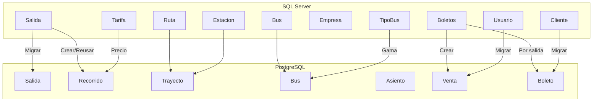

# Migración de Boletos (tickets)

## Visión general

La migración de boletos es el paso más complejo y costoso del pipeline. Los boletos legacy (`boleto` en SQL Server) están asociados a salidas (`salida`). La migración recorre cada salida y migra todos sus boletos.

## Estrategia



## Algoritmo principal

`Migrador::migrarSalida()` (en `src/Migration/Migrador.php`):

```php
public function migrarSalida($salidas = 100): array {
    // 1. Fetch N salidas desde legacy
    $salidas = $this->fetchSalidas($salidas);

    // 2. Por cada salida:
    foreach ($salidas as $salida) {
        // a) Migrar empresa asociada
        // b) Migrar trayecto (ruta → trayecto + subtrayectos)
        // c) Crear o reusar recorrido
        // d) Migrar bus + asientos
        // e) Crear salida
        // f) Migrar todos los boletos de la salida
    }
}
```

### Fetch de salidas

```sql
SELECT TOP $salidas s.*, i.ruta_codigo, i.tipo_bus_id, i.empresa_id
FROM salida s
LEFT JOIN itineario i ON i.id = s.itinerario_id
WHERE s.estado_id in (1,2)
ORDER BY s.fecha DESC
```

Solo salidas con estado activo (1) o completado (2).

### Migración de boletos por salida

Por cada boleto en la salida:

1. **Verificar duplicado**: `yaMigrado('boleto', $legacyId)`
2. **Migrar usuario**: `migrarUsuario($boletoOld)`
3. **Migrar cliente**: `migrarCliente($boletoOld)`
4. **Crear cliente dummy** si no existe: `Cliente Migrado`
5. **Resolver asiento**: por legacy_id o fallback al primer asiento del bus
6. **Crear venta**: `crearVenta($usuarioId, $boletoOld)`
7. **Insertar boleto**:

```php
INSERT INTO boleto (salida_id, recorrido_id, cliente_id, venta_id, asiento_id, created_at, legacy_id)
VALUES (:salida_id, :recorrido_id, :cliente_id, :venta_id, :asiento_id, :created_at, :legacy_id)
```

### Manejo transaccional

Cada salida se migra en su propia transacción:

```php
$this->newConn->beginTransaction();
try {
    // Migrar todo
    $this->newConn->commit();
} catch (\Throwable $e) {
    $this->newConn->rollBack();
    // Log error y continuar
}
```

Si una salida falla, las demás continúan. Los errores se registran pero no detienen el proceso.

### Control de progreso

```php
if (($i + 1) % 10 === 0) {
    $output->write(sprintf("\r<info>Salidas... %d/%d</info>", min($i + 1, $total), $total));
}
if (($i + 1) % 50 === 0) {
    if ($onProgress) $onProgress(); // Reset debug data
}
```

### Escalabilidad

- El parámetro `$salidas` controla cuántas salidas (y sus boletos) se migran por lote
- Cada salida puede tener múltiples boletos (decenas o cientos)
- Se recomienda comenzar con valores pequeños (100) e incrementar según el rendimiento
- Memory limit configurado a 2G: `ini_set('memory_limit', '2G')`

## Sincronización incremental

Archivo: `src/Command/SincronizarCommand.php`

Para migrar boletos nuevos después de la migración inicial:

```bash
docker compose exec backend php bin/console app:sincronizar
```

Este comando usa `Migrador::migrarBoletosRecientes()` que migra solo salidas no migradas previamente.

## Verificación de duplicados

```php
public function yaMigrado(string $tabla, string $legacyId): bool {
    $sql = match ($tabla) {
        'boleto' => "SELECT 1 FROM boleto WHERE legacy_id = :lid",
        // ...
    };
    return $this->newConn->fetchOne($sql, ['lid' => $legacyId]) !== false;
}
```
