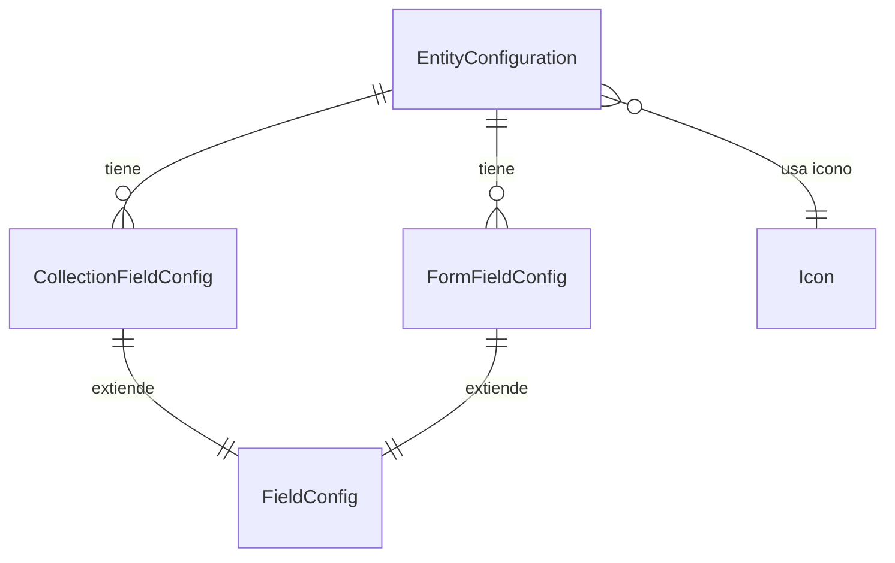

# Subdominio Configuración

Gestiona la configuración dinámica de entidades. Permite que el frontend sea completamente genérico, adaptándose automáticamente a la estructura de cada entidad.

## Entidades

### EntityConfiguration

Archivo: `src/Entity/Configuration/EntityConfiguration.php`

- Almacena metadatos de configuración por clase de entidad
- Atributo único: `entityClass` (nombre corto de la clase, e.g. "Boleto", "Usuario")
- Relacionado a: `CollectionFieldConfig` (campos de listado), `FormFieldConfig` (campos de formulario), `Icon` (icono asociado)
- Tiene `updatedAt` para seguimiento de cambios

```php
#[ORM\Column(length: 255, unique: true)]
public string $entityClass;

#[ORM\OneToMany(mappedBy: 'entityConfig', targetEntity: CollectionFieldConfig::class, cascade: ['persist', 'remove'], orphanRemoval: true)]
private Collection $collectionFieldConfig;

#[ORM\OneToMany(mappedBy: 'entityConfig', targetEntity: FormFieldConfig::class, cascade: ['persist', 'remove'], orphanRemoval: true)]
private Collection $formFields;
```

### CollectionFieldConfig

Archivo: `src/Entity/Configuration/CollectionFieldConfig.php`

- Configuración de columnas en vistas de listado/tabla
- Extiende `FieldConfig`
- Propiedades adicionales: `sortable` (ordenable), `filterable` (filtrable)

### FormFieldConfig

Archivo: `src/Entity/Configuration/FormFieldConfig.php`

- Configuración de campos en formularios de creación/edición
- Extiende `FieldConfig`
- Propiedad adicional: `groupName` (agrupación visual de campos)

### FieldConfig (MappedSuperclass)

Archivo: `src/Entity/Configuration/FieldConfig.php`

- Clase base con campos comunes:
  - `field`: nombre del campo en la entidad
  - `position`: posición de ordenamiento
  - `visible`: si se muestra en UI
  - `label`: etiqueta visible
  - `attrs`: atributos adicionales (JSON)

## Diagrama de relaciones



## Flujo de configuración

1. **Sincronización automática**: `EntityConfigSynchronizer` lee metadatos de Doctrine y crea/actualiza configuraciones
2. **Personalización**: Admin puede modificar posiciones, visibilidad, etiquetas via GraphQL
3. **Notificación**: Cambios se publican via Mercure para que el frontend los reciba en tiempo real
4. **Frontend genérico**: El frontend lee la configuración y renderiza tablas y formularios dinámicamente

## Operaciones GraphQL

```graphql
# Obtener configuración de una entidad
query {
    entityConfigurationCollection(entityClass: "Boleto") {
        entityClass
        collectionFieldConfig {
            field
            label
            visible
            sortable
        }
        formFields {
            field
            label
            visible
            groupName
        }
    }
}

# Actualizar configuración
mutation {
    updateEntityConfigurationFields(
        input: {
            entityClass: "Boleto"
            formFields: [{ id: "/api/form_field_configs/5", visible: false }]
        }
    ) {
        entityClass
        updatedAt
    }
}
```
