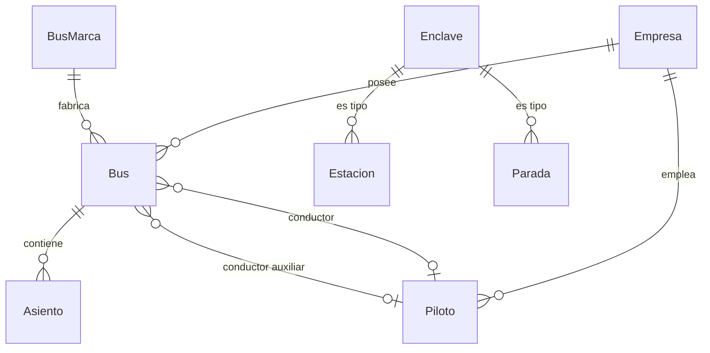

# Subdominio Flota

Gestiona las unidades de transporte (buses), sus componentes (asientos), conductores (pilotos) y puntos geográficos (enclaves).

## Entidades

### Bus

Archivo: `src/Entity/Bus.php`

- Unidad de transporte con matrícula, código interno, gama
- Relacionado a: `Empresa` (propietaria), `BusMarca` (fabricante), `Piloto` (conductor principal y auxiliar)
- Tiene colección de `Asiento`s
- Campos adicionales: año de fabricación, seguro, tarjetas de operaciones y rodaje

```php
#[ORM\Column(length: 50)]
private ?string $matricula = null;

#[ORM\Column(length: 15)]
private string $codigo;

#[ORM\Column(name: 'anoFabricacion', type: 'integer')]
private int $anoFabricacion;
```

### BusMarca

Archivo: `src/Entity/BusMarca.php`

- Catálogo de marcas/fabricantes de buses
- Atributo único: `nombre` (e.g. "Mercedes-Benz", "Volvo", "Scania")

### Asiento

Archivo: `src/Entity/Asiento.php`

- Asiento individual dentro de un bus
- Clase: A (ejecutivo) o B (económico) — representado como enum `TipoAsiento`
- Posición: fila y columna para el layout del bus

```php
#[ORM\Column(type: 'string', length: 1, enumType: TipoAsiento::class)]
private ?TipoAsiento $clase = null;
```

### Piloto

Archivo: `src/Entity/Piloto.php`

- Conductor con datos personales y licencia
- Campos únicos: `codigo` (código de piloto)
- Relacionado a: `Empresa` (empleadora)
- Incluye: fecha de nacimiento, número de licencia, fecha vencimiento licencia, DPI, seguro social

### Enclave

Archivo: `src/Entity/Enclave.php`

- Punto geográfico que puede ser estación o parada (Single Table Inheritance)
- Campos: nombre, dirección, latitud, longitud
- Subtipos: `Estacion`, `Parada`
- Relacionado a: `Venta` (ventas realizadas en el enclave)

## Diagrama de relaciones



## Reglas de negocio

1. Un bus debe tener al menos un asiento para ser operable
2. Un piloto debe tener licencia vigente (`fechaVencimientoLicencia`)
3. Un bus puede tener dos pilotos asignados (principal y auxiliar)
4. Los enclaves con tipo 'estacion' son terminales de venta; los tipo 'parada' son puntos de ascenso/descenso sin venta
5. El código de bus (string) es único y se hereda del sistema legacy
