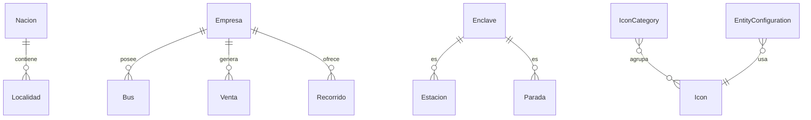

# Subdominio Infraestructura

Entidades base y catálogos del sistema: organización, geografía e iconografía.

## Entidades

### Icon

Archivo: `src/Entity/Icon.php`

- Icono del sistema (Lucide icons)
- Campos: `icon` (clase/nombre del icono), `name` (nombre descriptivo), `codepoint`, `popularity`, `tags` (JSON)
- Relacionado a: `IconCategory`

### IconCategory

Archivo: `src/Entity/IconCategory.php`

- Categoría de agrupación de iconos
- Contiene colección de `Icon`s via ManyToMany
- Propiedad virtual: `totalIcons` (calculada, no persistida)

### Empresa

Archivo: `src/Entity/Empresa.php`

- Empresa de transporte que opera servicios
- Campos: nombre, NIT, dirección, teléfono, email
- Relacionado a: `Bus` (flota de la empresa), `Venta` (ventas de la empresa), `Recorrido` (recorridos que ofrece)

### Localidad

Archivo: `src/Entity/Localidad.php`

- Ciudad o localidad geográfica
- Relacionado a: `Nacion` (país al que pertenece)
- Filtros: búsqueda OR por id y nombre

### Nacion

Archivo: `src/Entity/Nacion.php`

- País (mapeado a tabla `pais`)
- Nombre del país

### Estacion

Archivo: `src/Entity/Estacion.php`

- Terminal de venta (extiende Enclave via STI)
- Puede realizar ventas de boletos

### Parada

Archivo: `src/Entity/Parada.php`

- Punto de ascenso/descenso sin venta (extiende Enclave via STI)

## Diagrama de relaciones

## Reglas de negocio

1. Una empresa puede tener múltiples buses y ofrecer múltiples recorridos
2. Una estación es un enclave con capacidad de venta
3. Una parada es un enclave sin capacidad de venta (solo ascenso/descenso)
4. Los iconos se importan desde Lucide icons y se categorizan para facilitar la búsqueda
5. Una localidad pertenece a exactamente una nación (país)
