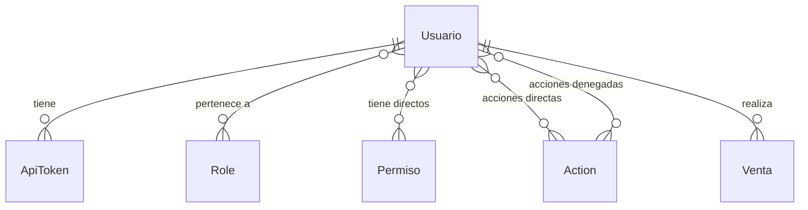

# Subdominio Personal

Gestiona los usuarios del sistema y los conductores (pilotos).

## Entidades

### Usuario

Archivo: `src/Entity/Usuario.php`

- Usuario del sistema con credenciales de acceso
- Extiende `PersonaBase` (nombre, apellido, email, teléfono)
- Autenticación via username + password
- Implementa `UserInterface` y `PasswordAuthenticatedUserInterface` de Symfony

**Relaciones IAM:**
- `userRoles`: roles asignados (colección de `Role`)
- `permisos`: permisos directos (colección de `Permiso`)
- `directActions`: acciones directas concedidas individualmente
- `deniedActions`: acciones denegadas individualmente
- `apiTokens`: tokens de acceso

**Relaciones operacionales:**
- `ventas`: ventas realizadas por el usuario

### Piloto

Archivo: `src/Entity/Piloto.php`

- Conductor de buses (compartido con subdominio Flota)
- Ver documentación en [subdominio Flota](../flota/index.md)

## Diagrama de relaciones

## Reglas de negocio

1. Cada usuario tiene un `username` único en el sistema
2. La contraseña se almacena hasheada (algoritmo auto de Symfony, con soporte legacy SHA-512)
3. Los permisos se resuelven en el PermissionManager combinando roles, permisos directos y acciones
4. Un usuario debe tener al menos un rol para acceder al sistema
5. Los pilotos son entidades separadas de los usuarios del sistema (un piloto puede no ser usuario y viceversa)
