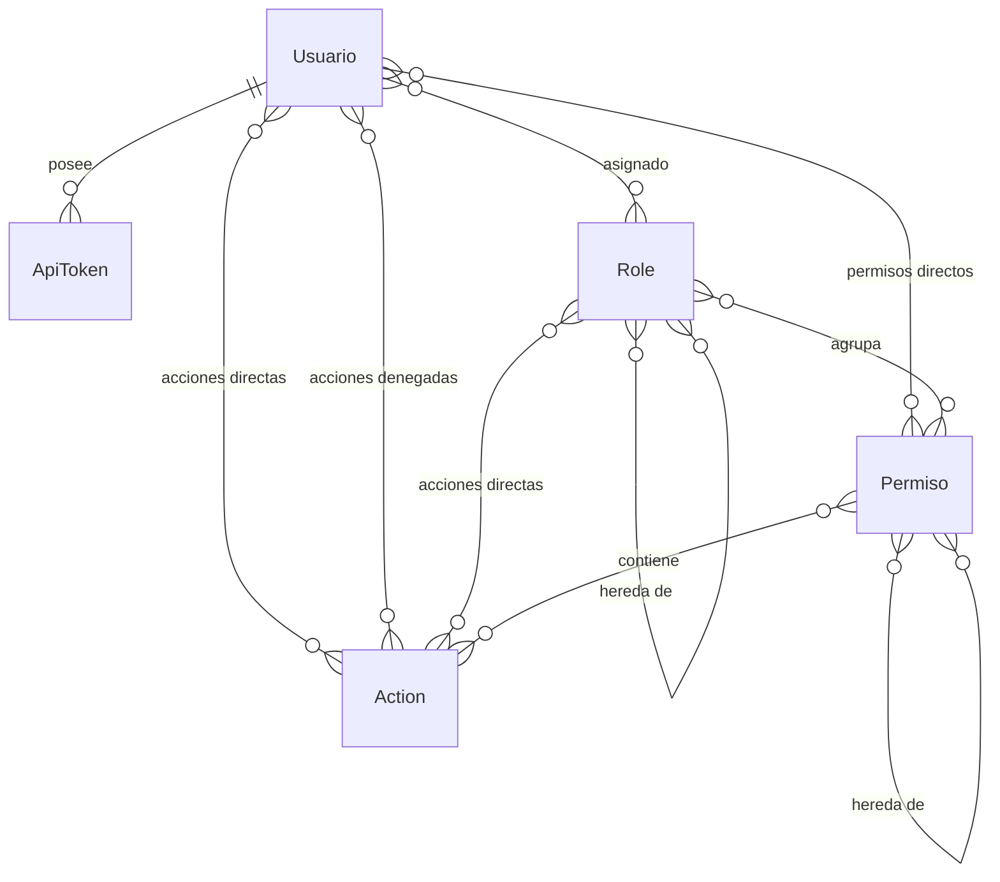

# Subdominio Seguridad / IAM

Gestiona el Identity & Access Management del sistema: autenticación, autorización y control de acceso.

## Entidades

### Usuario

Archivo: `src/Entity/Usuario.php`

- Usuario del sistema (compartido con subdominio Personal)
- Ver documentación completa en [subdominio Personal](../personal/index.md)
- Roles via ManyToMany a `Role` (tabla `user_role`)
- Permisos directos via ManyToMany a `Permiso`
- Acciones directas via ManyToMany a `Action` (tabla `user_direct_action`)
- Acciones denegadas via ManyToMany a `Action` (tabla `user_denied_action`)

### Role

Archivo: `src/Entity/Role.php`

- Rol jerárquico que agrupa permisos y acciones
- Jerarquía: puede tener roles padres (herencia recursiva)
- Relacionado a: `Permiso` (vía `role_permiso`), `Action` (vía `role_action`)

### Permiso

Archivo: `src/Entity/Permiso.php`

- Grupo lógico de acciones relacionadas
- Jerarquía: puede tener permisos padres
- Contiene colección de `Action`s

### Action

Archivo: `src/Entity/Action.php`

- Acción atómica con código único en formato `recurso.operacion` (e.g. `boleto.ver`, `usuario.editar`)
- Campos: `codigo`, `recurso`, `operacion`, `grupo`, `nombre`, `ruta`

### ApiToken

Archivo: `src/Entity/ApiToken.php`

- Token de acceso bearer para autenticación stateless
- Prefijo `fdn_` + 64 caracteres hex
- Puede tener expiración opcional

## Diagrama de relaciones

## Flujo de autorización

Ver documentación completa en [IAM overview](../../iam/overview.md).

## Entidades de soporte (tablas pivote)

| Tabla | Descripción |
|-------|-------------|
| `user_role` | Asignación usuario-rol |
| `role_permiso` | Asignación rol-permiso |
| `permiso_action` | Asignación permiso-acción |
| `role_action` | Acciones directas de un rol |
| `user_direct_action` | Acciones concedidas directamente a un usuario |
| `user_denied_action` | Acciones denegadas a un usuario |
| `role_role` | Jerarquía de roles (padre → hijo) |
| `permiso_permiso` | Jerarquía de permisos (padre → hijo) |

## Matriz de permisos

Ver [Permission Matrix](../../iam/permission-matrix.md) para el detalle completo de roles y acciones.
