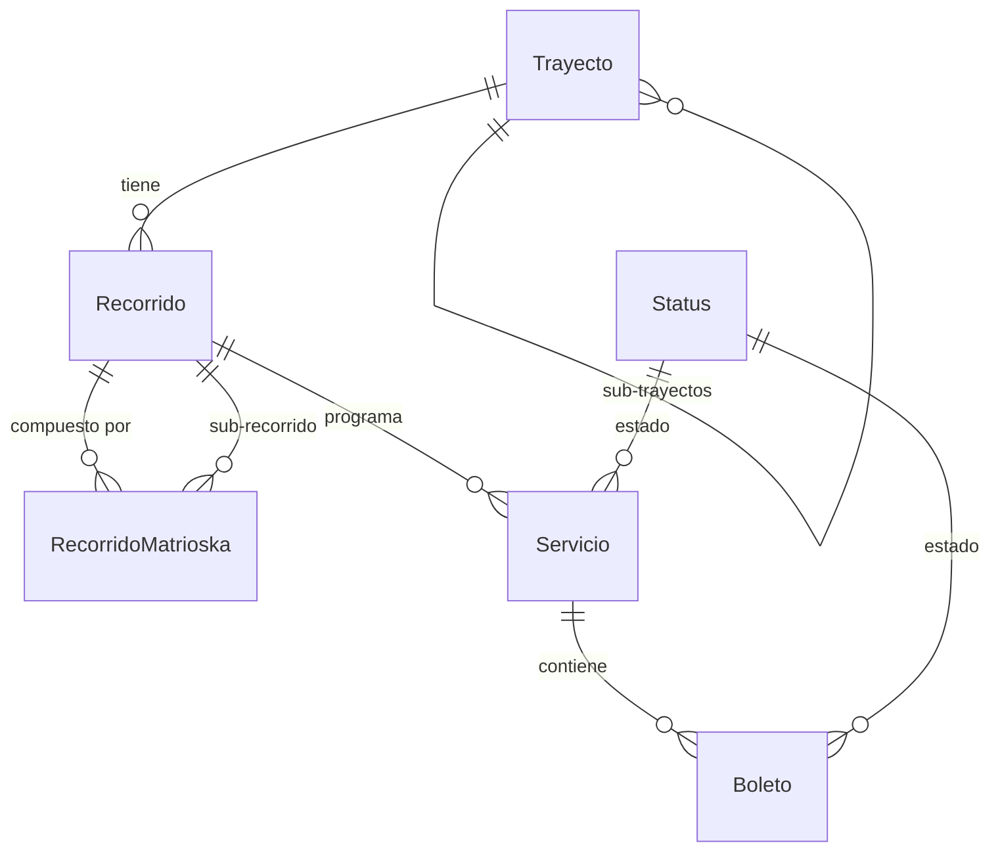

# Subdominio Transporte

Núcleo del dominio de FDN Transportes. Gestiona la operación de transporte de pasajeros.

## Entidades

### Boleto

Archivo: `src/Entity/Boleto.php`

- Representa un boleto de pasaje vendido
- Relacionado a: `Servicio` (viaje), `Cliente` (comprador), `Asiento` (asiento asignado), `Venta` (transacción), `Recorrido` (ruta)
- Campos principales: `legacyId`, `createdAt`
- El precio se maneja via `Servicio.Recorrido` (precios embeddables)

### Trayecto

Archivo: `src/Entity/Trayecto.php`

- Segmento de ruta entre dos enclaves (origen → destino)
- Jerarquía: un trayecto puede tener sub-trayectos (vía `trayecto_trayecto`)
- Incluye distancia en km y duración estimada
- Puede tener trayecto inverso (REV-{codigo})
- `legacyId` opcional para trazabilidad con rutas legacy

### Recorrido

Archivo: `src/Entity/Recorrido.php`

- Combina un trayecto con una empresa y precios
- Tiene dos precios embebidos: `Precio` clase A y clase B (usando `Money\Money`)
- Puede tener sub-recorridos via `RecorridoMatrioska`
- El nombre se genera como `Ruta-{codigo}` durante la migración

### RecorridoMatrioska

Archivo: `src/Entity/RecorridoMatrioska.php`

- Relación recursiva entre recorridos padre e hijo
- Permite composición de recorridos complejos
- Incluye `posicion` para ordenamiento

### Servicio

Archivo: `src/Entity/Servicio.php`

- Viaje programado con fecha, recorrido, bus y piloto
- Una instancia concreta de un recorrido en una fecha específica
- Contiene colección de `Boleto`s vendidos
- `legacyId` para trazabilidad con salidas legacy

### Status

Archivo: `src/Entity/Status.php`

- Catálogo de estados (activo/inactivo)
- Referenciado por FK desde entidades que usan `StatusTrait`

## Diagrama de relaciones

## Reglas de negocio

1. Un boleto siempre pertenece a un servicio y una venta
2. Un trayecto debe tener origen y destino distintos
3. Los precios de un recorrido se expresan en dos clases (A y B)
4. Un servicio no puede tener más boletos que asientos disponibles en el bus asignado
5. Los sub-trayectos se generan automáticamente durante la migración desde rutas legacy
