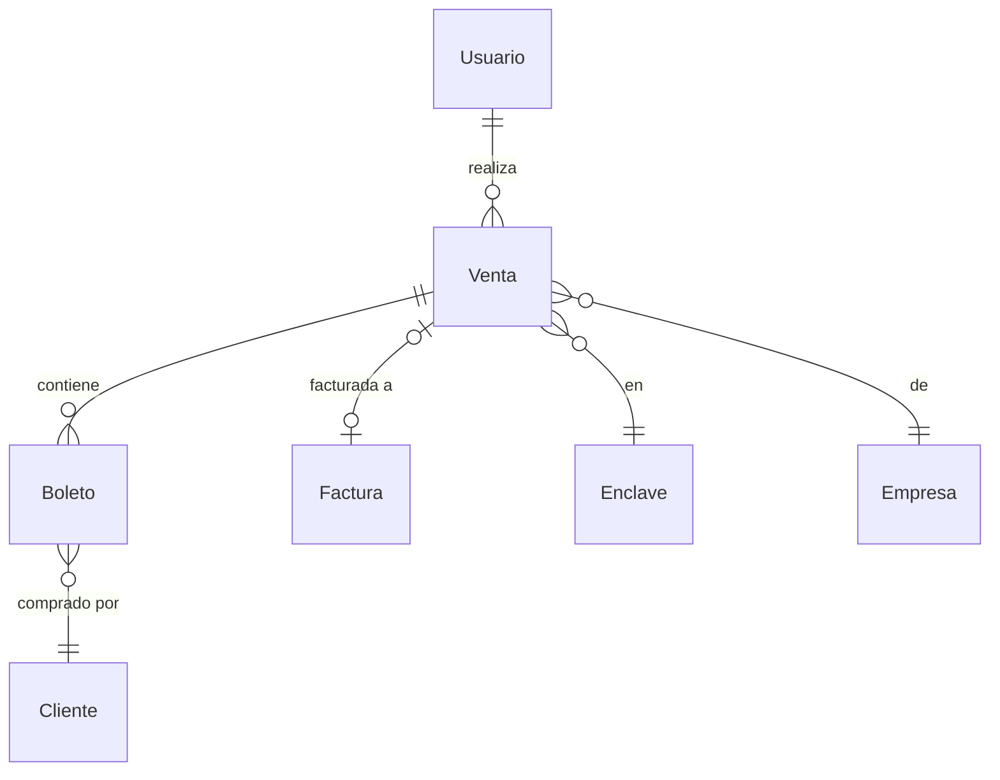
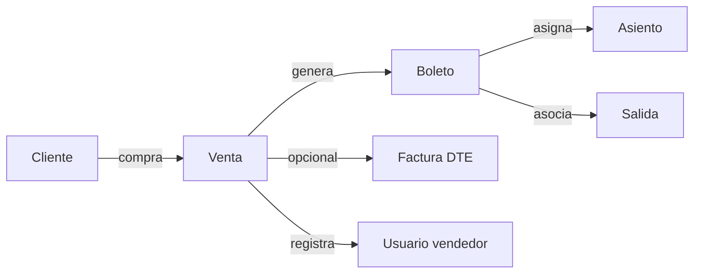

# Subdominio Venta

Gestiona las transacciones comerciales: ventas de boletos, facturación electrónica (DTE) y clientes.

## Entidades

### Venta

Archivo: `src/Entity/Venta.php`

- Transacción que agrupa uno o más boletos
- Relacionado a: `Usuario` (vendedor), `Enclave` (lugar de venta), `Empresa`, `Factura` (opcional)
- Contiene colección de `Boleto`s

```php
#[ORM\ManyToOne(inversedBy: 'ventas')]
#[ORM\JoinColumn(nullable: false)]
private ?Usuario $usuario = null;

#[ORM\OneToMany(targetEntity: Boleto::class, mappedBy: 'venta')]
private Collection $boletos;
```

### Factura

Archivo: `src/Entity/Factura.php`

- Documento Tributario Electrónico (DTE)
- Campos: DTE number, UUID, serie, fecha, emisor (NIT, nombre), receptor (NIT, nombre)
- Relación OneToOne con Venta

```php
#[ORM\OneToOne(cascade: ['persist', 'remove'])]
private ?Factura $factura = null;
```

### Cliente

Archivo: `src/Entity/Cliente.php`

- Extiende `PersonaBase` (nombre, apellido, email, teléfono)
- Comprador de boletos
- Se crea automáticamente durante la migración desde el legacy

## Diagrama de relaciones



## Reglas de negocio

1. Una venta puede contener múltiples boletos pero una sola factura
2. El vendedor (usuario) es obligatorio en toda venta
3. La factura se genera opcionalmente (no todas las ventas requieren DTE)
4. Un cliente se crea automáticamente si no existe durante la venta
5. El enclave de venta puede ser diferente al origen del viaje

## Flujo de venta


