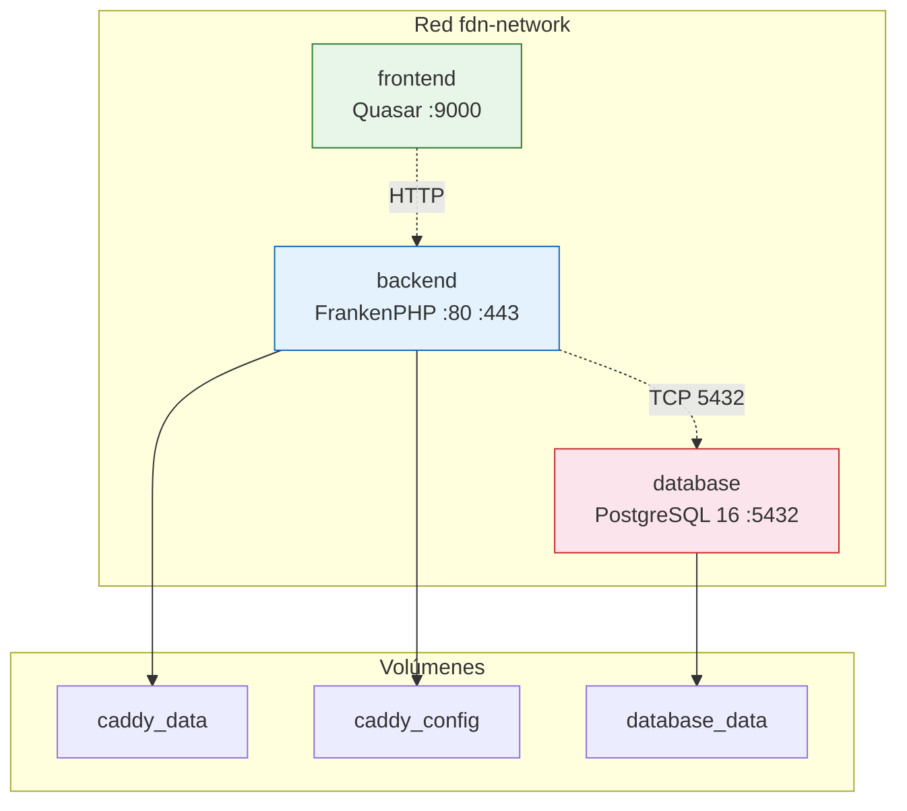

# Docker — Stack Overview

El proyecto FDN Transportes utiliza Docker Compose para orquestar **3 servicios** que conforman el stack completo de la aplicación.

## Arquitectura de servicios

## Servicios

| Servicio | Imagen | Puerto | Propósito |
|---|---|---|---|
| **backend** | `app-php` (FrankenPHP) | `:80` (HTTP), `:443` (HTTPS), `:443` (HTTP/3 UDP) | API Symfony + Mercure hub |
| **frontend** | `app-frontend` (Node + Quasar) | `:9000` | SPA Quasar con Vite dev server |
| **database** | `postgres:16-alpine` | `:5432` | Base de datos PostgreSQL 16 |

## Redes

Los 3 servicios comparten la red por defecto de Docker Compose. La comunicación interna usa los nombres de servicio como hostnames:

- Backend resuelve `database:5432` para PostgreSQL
- Frontend resuelve `backend` para la API (variable `FRONTEND_UPSTREAM`)
- Frontend usa `http://backend` como `API_PLATFORM_CREATE_CLIENT_ENTRYPOINT` en desarrollo

## Volúmenes

| Volumen | Montaje | Propósito |
|---|---|---|
| `caddy_data` | `/data` | Certificados TLS, datos de Caddy |
| `caddy_config` | `/config` | Configuración de Caddy |
| `database_data` | `/var/lib/postgresql/data` | Datos persistentes de PostgreSQL |

## Boot sequence

1. `database` inicia primero (healthcheck: `pg_isready`)
2. `backend` espera a que `database` esté healthy
3. `frontend` inicia concurrentemente

## Archivos de configuración

| Archivo | Propósito |
|---|---|
| `compose.yaml` | Configuración base (3 servicios, redes, volúmenes) |
| `compose.override.yaml` | Override para desarrollo (bind mounts, Xdebug, puertos expuestos) |
| `compose.prod.yaml` | Override para producción (imágenes compiladas, variables seguras) |
