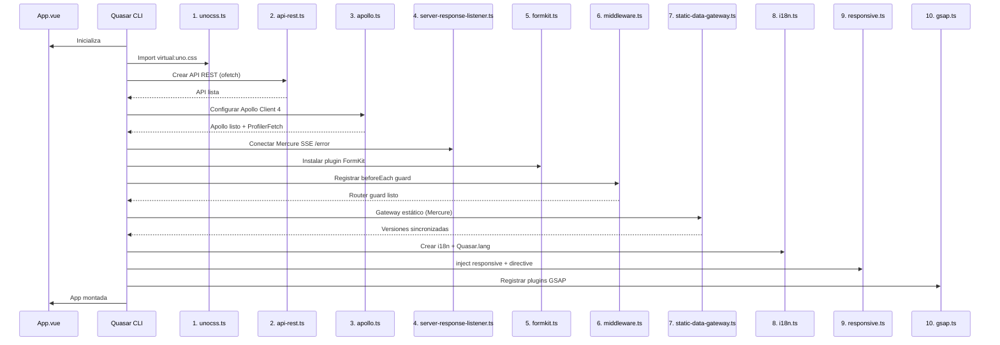

# Secuencia de Arranque (Boot)

La aplicación define 10 archivos de arranque en `quasar.config.ts` que se ejecutan en orden secuencial. Quasar 2 ejecuta los boots en el orden en que aparecen en el array `boot`.



## 1. `unocss.ts`
**Propósito**: Importar `virtual:uno.css` para activar UnoCSS. No tiene lógica adicional — simplemente importa los estilos generados por el plugin de Vite. Es el primer boot para asegurar que los estilos base estén disponibles antes de cualquier renderizado.

## 2. `api-rest.ts`
**Propósito**: Crear el cliente REST secundario usando `createApi()` de `src/composables/useApiRest.ts`. Configura:
- `baseURL`: `config.ENTRYPOINT` (`http://localhost/api`)
- `getAccessToken`: obtiene el JWT desde `useUserSessionStore`
- `onStart/onEnd`: controla `LoadingBar` de Quasar y `loadingStore`

Registra un `beforeEach` en el router que llama a `api.cancelAll()` para cancelar requests pendientes al cambiar de ruta. Expone la API globalmente vía `setApi()` para que `useApi()` la recupere.

## 3. `apollo.ts`
**Propósito**: Configurar Apollo Client 4 con una cadena de links personalizada (ver `graphql/links.md`) y un `InMemoryCache` con política `no-cache` por defecto. Crea un `ProfilerFetch` que captura el header `X-Debug-Token` de Symfony para depuración. Expone el cliente en `useApolloStore()` y lo provee via `app.provide(DefaultApolloClient)`.

## 4. `server-response-listener.ts`
**Propósito**: Conecta un `EventSource` a `http://localhost/.well-known/mercure?topic=error` para escuchar errores del servidor en tiempo real. Los mensajes recibidos se muestran como notificaciones Quasar de tipo `negative` con timeout infinito.

## 5. `formkit.ts`
**Propósito**: Instala el plugin de FormKit 2 en la aplicación Vue usando la configuración de `formkit.config.ts` (raíz del proyecto). Activa el sistema de formularios con el theme personalizado FDN.

## 6. `middleware.ts`
**Propósito**: Registra un guard `router.beforeEach` que:
1. Permite rutas públicas (`login`, `forbidden`) sin autenticación
2. Redirige a `/login` si no hay sesión activa
3. Verifica permisos específicos si la ruta tiene `meta.requiresPermission`
4. **Prefetches de CRUD dinámico**: si la ruta tiene `params.entity`:
   - Si `meta.action == 'listar'`: llama a `store.collection()` para precargar datos
   - Si `meta.action == 'form'`: llama a `store.getFormSchema()` y, si hay `id`, `store.getItem(id)`

## 7. `static-data-gateway.ts`
**Propósito**: Sincroniza la configuración de entidades entre backend y frontend. Obtiene versiones de configuración vía REST (`/config-versions`) y, si detecta cambios, reinicializa las stores correspondientes. Registra handlers Mercure para `entity_configuration` y `graphql_schema` para actualizaciones en tiempo real.

## 8. `i18n.ts`
**Propósito**: Configura `vue-i18n` 11 con locale `es-ES` y mensajes desde `src/i18n/`. Establece el idioma de Quasar a español usando el pack de `src/layouts/lang/es.ts`. Nota: el `app.use(i18n)` está comentado en la implementación actual.

## 9. `responsive.ts`
**Propósito**: Provee el servicio `ResponsiveService` reactivo a toda la app. Inyecta `responsive` como provide, expone `$responsive` como propiedad global, y registra la directiva `v-responsive` para mostrar/ocultar elementos según breakpoint. También inicializa GSAP llamando a `useGsap()`.

## 10. `gsap.ts`
**Propósito**: Inicializa GSAP 3 registrando todos los plugins necesarios (Draggable, Flip, InertiaPlugin, ScrollTrigger, ScrollSmoother, SplitText, TextPlugin, CustomEase, etc.) y expone la variable global `gsap`.

## Orden completo

```
unocss → api-rest → apollo → server-response-listener → formkit → middleware → static-data-gateway → i18n → responsive → gsap
```
