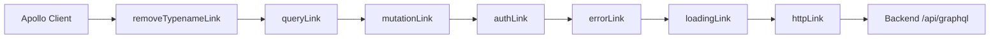
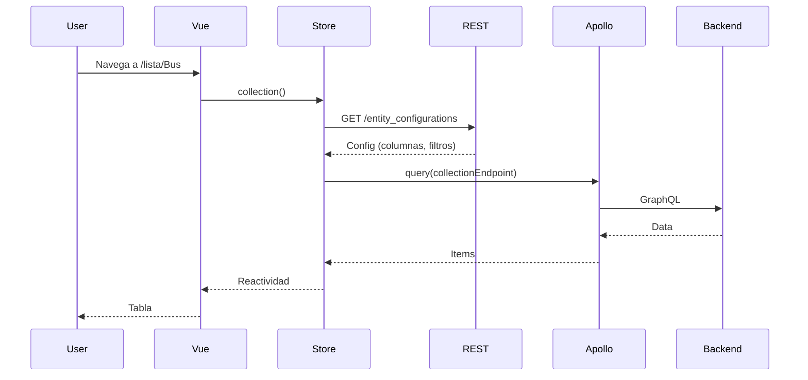

# Capa de Datos

La aplicación maneja tres canales de comunicación con el backend: **GraphQL** como capa primaria, **REST** como capa secundaria, y **Mercure** para tiempo real.

## 1. GraphQL — Apollo Client 4



### Cadena de links

| Link | Archivo | Función |
|------|---------|---------|
| `removeTypenameLink` | `src/graphql/links/removeTypenameLink.ts` | Elimina `__typename` de variables usando `RemoveTypenameFromVariablesLink` de Apollo |
| `queryLink` | `src/graphql/links/queryLink.ts` | Transforma IDs en IRIs (`/api/users/123`) para item queries |
| `mutationLink` | `src/graphql/links/mutationLink.ts` | Transforma objetos con `{id}` a IDs planos en inputs de mutation |
| `authLink` | `src/graphql/links/authLink.ts` | Inyecta header `Authorization: Bearer <token>` |
| `errorLink` | `src/graphql/links/errorLink.ts` | Maneja errores: 401 → login, 500 → detalle, GraphQL → notificación |
| `loadingLink` | `src/graphql/links/loadingLink.ts` | Controla `LoadingBar` con anti-flicker (150ms) y `loadingStore` con prioridades |
| `httpLink` | Creado en `apollo.ts` | Link terminal hacia `config.ENTRYPOINT_GRAPHQL` |

### Políticas de caché

```typescript
defaultOptions: {
  watchQuery: { fetchPolicy: 'no-cache' },
  query: { fetchPolicy: 'cache-first' },
  mutate: { errorPolicy: 'all' },
}
```

- `watchQuery`: sin caché (siempre red)
- `query`: cache-first con invalidación manual
- `mutate`: captura todos los errores

### InMemoryCache

Solo una política de tipos: `EntityConfiguration` keyed por `entityClass`. Sin fragment matching — los tipos se usan directamente sin `IntrospectionFragmentMatcher`.

### Profiler Fetch

El httpLink usa `createProfilerFetch()` que captura el header `X-Debug-Token` de Symfony y lo almacena en `useProfilerStore()` para mostrar el token del profiler en `ProfilerFooter.vue`.

## 2. REST — ofetch

### Endpoints REST

| Endpoint | Propósito | Origen |
|----------|-----------|--------|
| `GET /me/permissions` | Permisos del usuario | `session.fetchPermissions()` |
| `GET /entity_configurations?entityClass=X` | Configuración visual de entidad | `store.init()` |
| `GET /config-versions` | Versiones de configuración | `static-data-gateway.ts` |

### Cliente REST (`src/composables/useApiRest.ts`)

Implementación propia sobre `fetch` con 175 líneas. Características:

- **Auth**: Inyecta Bearer token automáticamente desde `getAccessToken`
- **Cache interno**: Map con TTL y tags de invalidación
- **Deduplicación**: Map `inflight` para evitar requests duplicados
- **Retry**: Reintentos configurables con delay exponencial
- **Cancelación**: `AbortController` por request; `cancelAll()` en `beforeEach` del router
- **Profiler**: Captura `X-Debug-Token` como Apollo
- **Ciclo de carga**: Callbacks `onStart`/`onEnd` para LoadingBar y loadingStore

```typescript
const api = createApi({
  baseURL: config.ENTRYPOINT,
  getAccessToken: () => session.token,
  onStart: (key) => { LoadingBar.start(); loadingStore.start(key) },
  onEnd: (key) => { LoadingBar.stop(); loadingStore.stop(key) },
})
```

## 3. Mercure — Tiempo Real

### StaticDataGateway (`src/services/StaticDataGateway.ts`)

Servicio singleton (80 líneas) que maneja suscripciones Mercure:

- `register(topic, handler)`: asocia handler a un topic
- `start()`: conecta EventSource para cada topic
- `stop()`: cierra todas las conexiones
- Reconexión automática cada 5 segundos

**Topics registrados:**
- `entity_configuration`: reinicializa store cuando cambia la configuración
- `graphql_schema`: recarga schemaStore cuando cambia el esquema

### Server Response Listener (`src/boot/server-response-listener.ts`)

Conexión permanente al topic `error` de Mercure para mostrar errores del servidor como notificaciones Quasar.

### Composables Mercure

- `useMercureItem` (`src/composables/mercureItem.ts`): Suscripción a cambios de un item. Si el payload tiene 1 campo → eliminación; si no → actualización.
- `useMercureList` (`src/composables/mercureList.ts`): Suscripción a cambios en lista. Actualiza items vía `updateItem()`/`deleteItem()`.

Ambos se activan automáticamente cuando la store tiene `hubUrl` y se limpian en `onBeforeUnmount`.

## 4. Flujo típico


