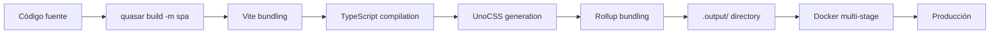

# Build y Despliegue

## Pipeline de build



## Comandos

| Comando | Propósito |
|---------|-----------|
| `npm run dev` | Servidor de desarrollo Quasar (SPA) |
| `npm run build` | Build de producción → `dist/` |
| `npm run format` | Formateo con Prettier |
| `npm run test` | No-op (no hay test framework) |

## Entorno de desarrollo

El servidor de desarrollo se ejecuta en el puerto 9000 (Docker) o el que asigne Quasar en desarrollo local. Usa hot-reload de Vite.

## Docker

La imagen Docker usa multi-stage build:

1. **Base**: `node:24-alpine` con `libc6-compat`
2. **Dev**: `npm install && npm run dev` en puerto 9000
3. **Build**: `npm install --omit=dev && npm run build` genera `.output/`
4. **Prod**: Sirve `.output/server/index.mjs` en puerto 9000

## Variables de entorno

| Variable | Desarrollo | Producción |
|----------|-----------|------------|
| `PORT` | 9000 | 9000 |
| `HOSTNAME` | `localhost` | `0.0.0.0` |
| `NODE_ENV` | — | `production` |

## Endpoints API

Configurados en `src/config/config.ts`:

```typescript
export const config = {
  ENTRYPOINT: 'http://localhost/api',
  ENTRYPOINT_GRAPHQL: 'http://localhost/graphql',
}
```
