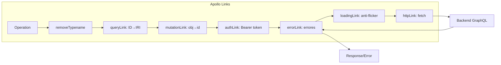

# Cadena de Links Apollo

Los links se ejecutan en orden. Cada uno transforma la operación antes de pasarla al siguiente.

## removeTypenameLink

**Archivo**: `src/graphql/links/removeTypenameLink.ts`

```typescript
import { RemoveTypenameFromVariablesLink } from '@apollo/client/link/remove-typename'
export default new RemoveTypenameFromVariablesLink()
```

Elimina el campo `__typename` de las variables de las operaciones para evitar errores del servidor.

## queryLink

**Archivo**: `src/graphql/links/queryLink.ts` — 23 líneas

Transforma IDs en IRIs para queries de item individual. Si una query tiene un argumento `id` y el resultado no contiene `collection`, transforma el ID numérico a IRI:

```
id: 123 → id: "/api/users/123"
```

Esto es necesario porque API Platform usa IRIs como identificadores.

## mutationLink

**Archivo**: `src/graphql/links/mutationLink.ts` — 27 líneas

Transforma objetos con formato `{ id: 123, ... }` a IDs planos en los inputs de mutation, a menos que `context.keepId` sea `true`. Esto permite pasar objetos completos desde el formulario y que el link extraiga solo el ID para las relaciones.

```typescript
// Input original: { marca: { id: 1, name: "Mercedes" } }
// Transformado:  { marca: 1 }
```

## authLink

**Archivo**: `src/graphql/links/authLink.ts` — 13 líneas

Inyecta el header `Authorization: Bearer <token>` en cada operación:

```typescript
const sessionStore = useUserSessionStore()
if (sessionStore.token) {
  headers['Authorization'] = `Bearer ${sessionStore.token}`
}
operation.setContext({ headers })
```

## errorLink

**Archivo**: `src/graphql/links/errorLink.ts` — 78 líneas

Maneja errores de diferentes tipos:

| Error | Acción |
|-------|--------|
| `ServerError` 401 | Limpia sesión, redirige a login |
| `ServerError` 500 | Muestra detalle del error Symfony |
| `ServerError` 404 | Notifica endpoint no encontrado |
| `CombinedGraphQLErrors` | Muestra mensajes GraphQL con debugMessage |
| `ServerParseError` | Muestra error de parseo |
| Otros | Notifica error de conexión |

Usa `merror()` del EventBus para mostrar notificaciones.

## loadingLink

**Archivo**: `src/graphql/links/loadingLink.ts` — 78 líneas

Controla el estado de carga con anti-flicker:

- Espera 150ms antes de mostrar carga (evita flicker en operaciones rápidas)
- Usa `loadingStore` con contador de operaciones y prioridades
- Controla `LoadingBar` de Quasar (se inicia con prioridad >= 1)

```typescript
const key = ctx.loadingKey || operation.operationName || 'anonymous'
const priority = ctx.priority ?? 1
const delayMs = ctx.delayMs ?? 150
```

## httpLink

**Creado en**: `src/boot/apollo.ts`

Link terminal que envía la operación HTTP al endpoint `config.ENTRYPOINT_GRAPHQL` usando `createProfilerFetch()`.

## Diagrama de flujo


