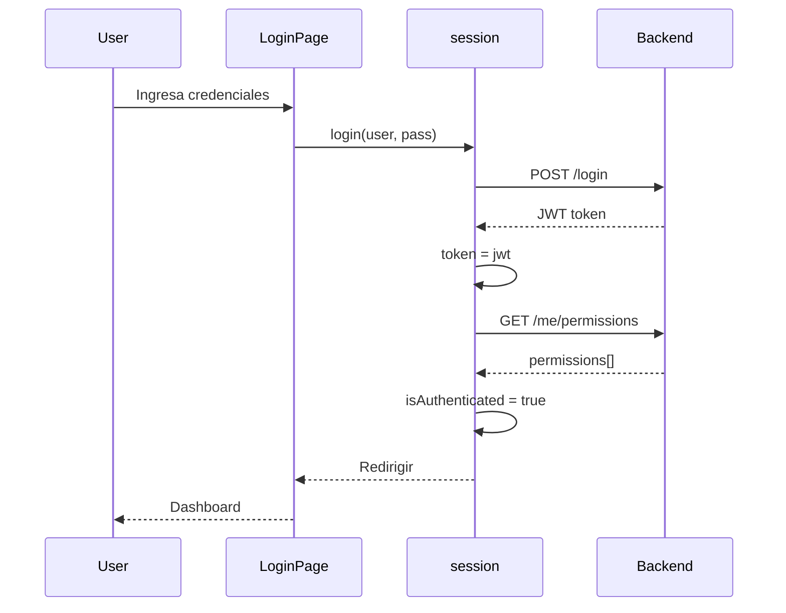

# Session Store

**Archivo**: `src/stores/autoimport/session.ts` — 128 líneas

La store de sesión maneja autenticación, JWT y permisos.

## Definición

```typescript
export const useUserSessionStore = defineStore('userSession', () => {
  // Estado
  const user = ref<User | null | undefined>()
  const token = ref<string | null>(null)
  const permissions = ref<string[]>([])
  const error = ref<string | undefined>(undefined)
  const violations = ref<SubmissionErrors | undefined>(undefined)
  const redirectTo = ref('/')

  // Getters
  const isAuthenticated = computed(() => user.value && token.value)
  const isAdmin = computed(() => permissions.value.some(p => p.startsWith('admin.') || p === 'ROLE_ADMIN'))
  // ...
})
```

## Estado persistido

```typescript
persist: { pick: ['user', 'token', 'permissions'] }
```

Usuario, token y permisos se persisten en localStorage para mantener la sesión entre recargas.

## Métodos

### `login(username, password)`
Envía POST a `/login` con credenciales. Si es exitoso, llama a `fetchSession()` para cargar permisos. En caso de error, setea `error.value`.

### `fetchSession()`
Obtiene permisos del usuario desde `GET /me/permissions` usando el cliente REST. Los permisos se almacenan como array plano en `permissions.value`.

### `fetchPermissions()`
Similar a `fetchSession()` pero específicamente para recargar permisos.

### `clear()`
Limpia todo el estado: token, user, permissions, error, violations, redirectTo. Efectivamente cierra la sesión.

### Verificación de permisos

```typescript
can(code: string): boolean     // Permiso individual
canAny(codes: string[]): boolean  // Al menos uno
canAll(codes: string[]): boolean  // Todos
```

## Sistema de permisos

Los permisos son strings planos (Flat Permission Set). Ejemplos:
```
usuario.ver, usuario.crear, usuario.editar, usuario.eliminar
admin.rol, admin.permiso, admin.accion, admin.entidad, admin.dashboard
```

No hay jerarquía ni herencia. `isAdmin` es un getter que verifica si el usuario tiene permisos que empiezan con `admin.` o el rol `ROLE_ADMIN`.

## Flujo de autenticación


