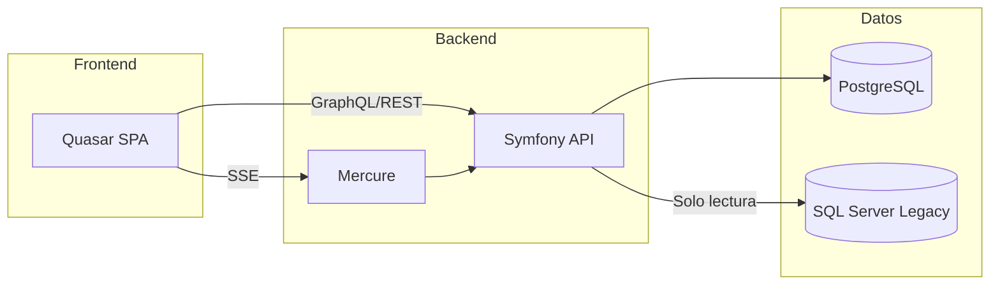

# FDN Transportes

> Sistema de gestión de transporte terrestre — Monorepo

**FDN Transportes** es un sistema integral para la gestión de venta de boletos, flota de autobuses, personal, rutas y administración de una empresa de transporte terrestre de pasajeros.

## Stack Tecnológico

| Capa | Tecnología |
|------|-----------|
| Backend | PHP 8.4+, Symfony 8.1, API Platform 4.3, FrankenPHP |
| Frontend | Quasar 2 + Vue 3.5 + Pinia 3 + Apollo Client 4 |
| Base de datos | PostgreSQL 16 + SQL Server 2012 (legacy) |
| Tiempo real | Mercure (integrado en Caddy) |
| Contenedores | Docker Compose (3 servicios) |

## Arquitectura en 30 segundos



## Documentación

| Sección | Descripción |
|---------|-------------|
| [Arquitectura](architecture/overview.md) | C4 Context & Container, decisiones arquitectónicas |
| [Docker](docker/overview.md) | Orquestación, entornos, troubleshooting |
| [Makefile](makefile/overview.md) | Referencia completa de comandos |
| [Backend](backend/architecture/overview.md) | Symfony, IAM, Base de datos, Migración, Subdominios |
| [Frontend](frontend/architecture/overview.md) | Quasar, patrones, módulos, componentes, stores |
| [Tecnologías](technologies.md) | Stack detallado con versiones |
| [Estructura](directory-structure.md) | Árbol de directorios del monorepo |

## Inicio Rápido

```bash
# Entorno de desarrollo
make dev

# Documentación
make docs-serve

# Tests backend
make test

# Acceso al contenedor backend
make sh
```

---

*Documentación generada con [MkDocs](https://www.mkdocs.org/) + [Material Theme](https://squidfunk.github.io/mkdocs-material/)*
