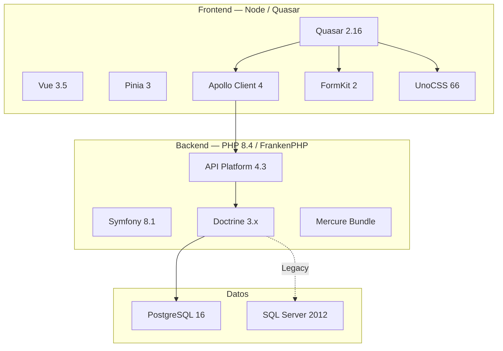

# Tecnologías del Stack

## Backend

| Tecnología | Versión | Propósito |
|---|---|---|
| PHP | 8.4+ | Lenguaje de programación |
| Symfony | 8.1 | Framework de aplicación |
| API Platform | 4.3.10 | Framework REST + GraphQL |
| Doctrine ORM | 3.6 | Mapeo objeto-relacional |
| Doctrine DBAL | 4.x | Conexiones a base de datos |
| Doctrine Migrations | 4.0 | Migraciones de esquema |
| Symfony Mercure Bundle | 0.4.2 | Integración Mercure |
| Symfony Security Bundle | 8.1 | Autenticación y autorización |
| Nelmio CORS Bundle | 2.6 | CORS headers |
| Stof Doctrine Extensions | 1.15 | Extensiones Doctrine (timestampable, etc.) |
| MoneyPHP | 4.9 | Manejo de monedas y precios |
| Twig | 3.27+ | Motor de plantillas |
| PHPUnit | 13.2 | Testing |
| PHPStan | — | Análisis estático |
| FrankenPHP | 1.x | Servidor PHP embebido en Caddy |
| Caddy | 2.x | Servidor web, proxy inverso, TLS |

### Extensiones PHP

| Extensión | Propósito |
|---|---|
| `pdo_pgsql` / `pgsql` | Conexión PostgreSQL |
| `pdo_dblib` | Conexión SQL Server vía FreeTDS |
| `sqlsrv` / `pdo_sqlsrv` | Conexión SQL Server vía MS ODBC |
| `apcu` | Caché de aplicación |
| `intl` | Internacionalización |
| `opcache` | Caché de opcodes (producción) |
| `xdebug` | Depuración (desarrollo) |
| `zip` | Compresión |

### Paquetes de desarrollo

| Paquete | Propósito |
|---|---|
| `symfony/maker-bundle` | Generación de código |
| `symfony/debug-bundle` | Depuración |
| `symfony/web-profiler-bundle` | Barra de depuración |
| `doctrine/doctrine-fixtures-bundle` | Data fixtures |
| `symfony/browser-kit` | Testing de integración |

## Frontend

| Tecnología | Versión | Propósito |
|---|---|---|
| Node.js | 20+ / 22+ / 24+ | Runtime |
| Quasar | 2.16.0 | Framework UI (modo SPA) |
| Vue | 3.5.22 | Framework reactivo |
| Pinia | 3.0.1 | Estado global |
| Vue Router | 4.x | Enrutamiento SPA |
| Apollo Client | 4.0.9 | Cliente GraphQL |
| Vue Apollo Composables | 5.0.0-alpha.2 | Integración Apollo + Vue |
| FormKit | 2.0.0 | Formularios dinámicos |
| UnoCSS | 66.5.10 | Framework CSS utility-first |
| GSAP | 3.14.2 | Animaciones |
| VueUse | 14.1.0 | Utilidades composables |
| Vue i18n | 11.0.0 | Internacionalización |
| Day.js | 1.11.19 | Manejo de fechas |
| GraphQL | 16.12.0 | Lenguaje de consulta |
| GraphQL Tag | 2.12.6 | Template literals para GraphQL |
| GQL Query Builder | 3.8.0 | Constructor de queries |
| Rambda | 0.32.0 | Utilidades funcionales |
| Voca | 1.4.1 | Manipulación de strings |
| Material Symbols | 0.40.1 | Iconos |
| Animate.css | 4.1.1 | Animaciones CSS |

### DevDependencies frontend

| Tecnología | Versión | Propósito |
|---|---|---|
| Quasar App Vite | 2.1.0 | Build tool |
| TypeScript | 5.9.2 | Tipado estático |
| UnoCSS Preset Wind4 | 66.5.10 | Preset de UnoCSS |
| unplugin-auto-import | 20.3.0 | Auto-import de símbolos |
| unplugin-vue-components | 30.0.0 | Auto-import de componentes |
| Prettier | 3.3.3 | Formateo de código |
| Autoprefixer | 10.4.2 | Prefixes CSS |
| intlify/unplugin-vue-i18n | 4.0.0 | Optimización i18n |

## Infraestructura

| Tecnología | Versión | Propósito |
|---|---|---|
| Docker | 24+ | Contenedores |
| Docker Compose | 2.x | Orquestación local |
| PostgreSQL | 16 (Alpine) | Base de datos principal |
| SQL Server | 2012 | Base de datos legada |
| FrankenPHP | 1.x | Servidor de aplicación |
| Caddy | 2.x | Servidor web + TLS + Mercure |
| Mercure | — | SSE hub (módulo Caddy) |

## Herramientas de documentación

| Tecnología | Versión | Propósito |
|---|---|---|
| MkDocs | — | Generador de documentación |
| Material for MkDocs | — | Tema de documentación |
| Mermaid | 11.6.0 | Diagramas en Markdown |
| GLightbox | — | Visualización de imágenes |

## Stack gráfico

