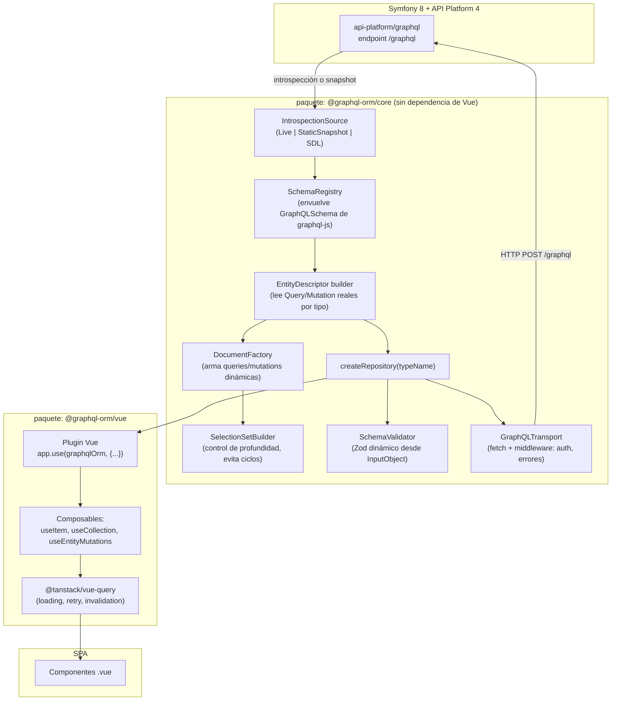
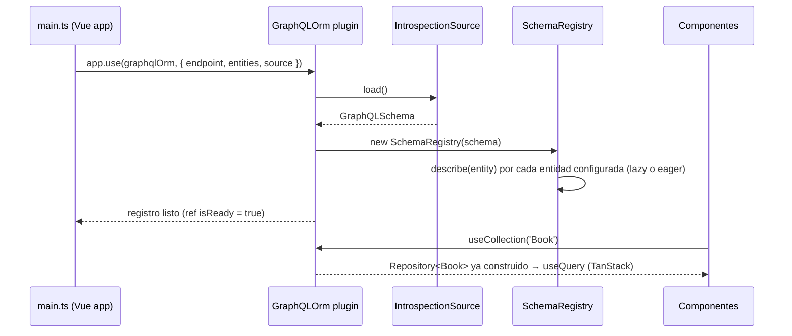

# GraphQL-ORM: cliente dinámico basado en introspección para Vue 3 + API Platform 4 (Symfony)

**Documento de especificación técnica — propuesta de implementación para agentes de IA**

| | |
|---|---|
| **Audiencia principal** | Agentes de IA (LLM coding agents) que van a implementar este sistema. Un humano también puede leerlo, pero el nivel de explicitud está calibrado para ejecución automática. |
| **Objetivo del documento** | Especificar, sin ambigüedad, la arquitectura, el stack y el algoritmo de un motor que parsea la introspección GraphQL de una API Platform 4 (Symfony) y genera en memoria, en runtime, un repositorio tipado por entidad (queries, mutaciones, argumentos, validación) para una SPA Vue 3. |
| **Cómo usar este documento** | Léelo completo antes de escribir código. La sección 15 contiene el runbook de ejecución fase por fase. Las secciones 3 y 8 contienen el conocimiento de dominio no obvio (cómo expone GraphQL API Platform realmente) que, si se ignora, produce una implementación que funciona con esquemas GraphQL genéricos pero falla contra API Platform en casos reales (paginación, orden, IDs, tipos duplicados por grupos de serialización). |
| **Verificado contra** | Documentación oficial de `api-platform/core` v4.3 / `api-platform/graphql` v4 (agosto 2026), paquete `graphql` (graphql-js) como implementación de referencia del lado del cliente, y el estado actual (2026) del ecosistema Vue + GraphQL. Ver sección 17. |

---

## Índice

0. [Nota de contexto y supuestos de versión](#0-nota-de-contexto-y-supuestos-de-versión)
1. [Resumen ejecutivo y decisión de arquitectura](#1-resumen-ejecutivo-y-decisión-de-arquitectura)
2. [Objetivos, alcance y no-objetivos](#2-objetivos-alcance-y-no-objetivos)
3. [Fundamentos: cómo expone GraphQL API Platform realmente](#3-fundamentos-cómo-expone-graphql-api-platform-realmente)
4. [Arquitectura de la solución](#4-arquitectura-de-la-solución)
5. [Stack tecnológico y justificación](#5-stack-tecnológico-y-justificación)
6. [Estructura del proyecto](#6-estructura-del-proyecto)
7. [Especificación de módulos (core, agnóstico de framework)](#7-especificación-de-módulos-core-agnóstico-de-framework)
8. [Casos límite de API Platform que el diseño debe cubrir](#8-casos-límite-de-api-platform-que-el-diseño-debe-cubrir)
9. [Capa Vue: plugin y composables](#9-capa-vue-plugin-y-composables)
10. [Flujo end-to-end de ejemplo (entidad `Book`)](#10-flujo-end-to-end-de-ejemplo-entidad-book)
11. [Tipado: runtime vs. compile-time (por qué son dos capas separadas)](#11-tipado-runtime-vs-compile-time-por-qué-son-dos-capas-separadas)
12. [Validación y manejo de errores](#12-validación-y-manejo-de-errores)
13. [Seguridad, introspección en producción, rendimiento y cache](#13-seguridad-introspección-en-producción-rendimiento-y-cache)
14. [Testing](#14-testing)
15. [Plan de implementación por fases (runbook para el agente)](#15-plan-de-implementación-por-fases-runbook-para-el-agente)
16. [Por qué esta propuesta gana el premio](#16-por-qué-esta-propuesta-gana-el-premio)
17. [Glosario y referencias](#17-glosario-y-referencias)

---

## 0. Nota de contexto y supuestos de versión

El enunciado original menciona **Symfony 8.0** y **API Platform V4**. Verificación al momento de escribir este documento (5 de agosto de 2026):

- **Symfony 8.0** se publicó el 27 de noviembre de 2025 como versión no-LTS (8 meses de soporte) y **alcanzó fin de mantenimiento el 29 de julio de 2026**. La rama estable actual es **Symfony 8.1** (mayo 2026, soporte hasta enero 2027), con 8.2 prevista para noviembre 2026. Esto no es un bloqueante para lo que sigue: nada en esta arquitectura depende de una versión específica de Symfony. Si el proyecto es nuevo, vale la pena confirmar si conviene partir de 8.1 en vez de 8.0.
- **API Platform 4** existe y está en su versión **4.3** (rama estable actual). El soporte de GraphQL en la v4 se instala como **paquete separado**: `composer require api-platform/graphql`, ya no viene incluido por defecto en el core. Esto es relevante porque el primer paso de cualquier implementación es confirmar que ese paquete está instalado y `graphql.enabled` (Laravel) o la ruta `/graphql` (Symfony Flex) responde.

Todo el análisis de la sección 3 y 8 está basado en la documentación actual de `api-platform/graphql` v4, no en versiones 2.x/3.x (hay diferencias reales, sobre todo en namespaces de atributos PHP: `ApiPlatform\Metadata\GraphQl\*` en vez de `ApiPlatform\Core\Annotation\*`).

---

## 1. Resumen ejecutivo y decisión de arquitectura

La petición original pide tres cosas encadenadas: (1) parsear la introspección GraphQL en runtime, (2) construir en memoria una estructura tipada de entidades + queries + mutaciones + argumentos, (3) que esto funcione como un "ORM" cliente que abstrae el acceso a datos. La decisión de arquitectura es:

| Capa | Decisión | Por qué (resumen; justificación completa en sección 5) |
|---|---|---|
| Parseo de introspección | `graphql` (graphql-js) — `getIntrospectionQuery()` + `buildClientSchema()` / `buildSchema()` | Es la implementación de referencia del propio spec de GraphQL. Reescribir un parser de introspección a mano es reinventar ~10 años de casos límite ya resueltos (unions, interfaces, deprecaciones, `ofType` anidado). |
| Motor "ORM" (schema → entidades → documentos → repos) | **Paquete propio**, construido sobre `graphql-js` | No existe ninguna librería que haga *exactamente* esto (generar repos CRUD tipados en runtime a partir de introspección arbitraria contra un backend API Platform). Es la pieza central que hay que construir; el resto del stack es soporte. |
| Transporte HTTP / manejo de estado de red (loading, retry, cache de peticiones) | `@tanstack/vue-query` (antes Vue Query) | No reinventa gestión de estado asíncrono. TanStack Query documenta oficialmente un modo de uso con GraphQL y está activamente mantenido (releases semanales en 2026). Separa "qué pedir" (nuestro motor) de "cómo gestionar el ciclo de vida de la petición" (Query). |
| Validación runtime de variables/argumentos | Esquemas **Zod construidos dinámicamente** a partir de los `InputObject` de introspección | Da validación real (no cosmética) sin escribir un validador a mano por entidad, y sin acoplar el core a un framework de formularios concreto. |
| Tipado estático (DX, autocompletado) | Capa **complementaria y opcional**: snapshot del schema (`bin/console api:graphql:export`) + `gql.tada` o `graphql-code-generator` | Un sistema puramente runtime **no puede** dar tipos TypeScript en compile-time — es una limitación del lenguaje, no una carencia de diseño (sección 11 lo explica). Se resuelve con una capa desacoplada que no condiciona el funcionamiento del motor runtime. |
| Transporte de red puro | `fetch` nativo envuelto en un *link chain* propio (inspirado en Apollo Links / urql Exchanges) | Evita cargar el peso de Apollo Client (cache normalizado que competiría con nuestro propio motor de entidades) manteniendo el patrón de middleware componible que sí vale la pena copiar de Apollo/urql. |

**En una frase:** introspección con `graphql-js` → registro de esquema propio que describe entidades y operaciones reales de API Platform (no un GraphQL genérico) → constructor dinámico de documentos y validadores → repositorios `Repository<T>` → composables Vue sobre TanStack Query. Tipado estático como capa aparte, no como dependencia dura.

---

## 2. Objetivos, alcance y no-objetivos

**Objetivos:**

- Dado un endpoint GraphQL de API Platform y una lista de nombres de tipos (`['Book', 'Author', ...]`), construir en runtime, sin generación de código, un `Repository<T>` por entidad con `findById`, `findAll` (filtros, orden, paginación), `create`, `update`, `delete`, y una vía genérica `call()` para queries/mutaciones custom.
- Que la forma de las queries generadas (selección de campos, forma de la paginación, forma del argumento `order`, tipo del identificador) se derive **siempre** de lo que la introspección reporta, nunca de una convención asumida a priori — porque, como muestra la sección 8, API Platform permite configurar variantes reales de todo eso por recurso.
- Validación de variables de mutación contra el `InputObject` real antes de enviar la petición.
- Integración Vue 3 idiomática vía plugin + composables.

**No-objetivos (explícitos, para que el agente no expanda el alcance):**

- Este sistema **no reemplaza la autorización del backend**. La validación cliente es una mejora de UX (falla rápido, mensajes claros) y de DX (autocompletado, menos código repetitivo), no un límite de seguridad. API Platform sigue siendo la única fuente de verdad para `security`/`securityPostDenormalize`.
- No se construye un cache normalizado tipo Apollo `InMemoryCache`. TanStack Query cachea por *query key*, no por entidad normalizada. Si más adelante se necesita cache normalizado (para que actualizar un `Book` en un componente se refleje instantáneamente en otro que también lo muestra), es una extensión de la Fase 6 (sección 15), no parte del MVP.
- No se cubren Subscriptions (Mercure) en el MVP; se documentan como extensión en la sección 13 porque el mecanismo de API Platform es particular (devuelve `mercureUrl`, no un websocket GraphQL estándar) y merece su propio módulo.

---

## 3. Fundamentos: cómo expone GraphQL API Platform realmente

Esta sección es la que separa una implementación "genérica de GraphQL" de una que funciona de verdad contra API Platform. Todo lo siguiente es específico de API Platform, no del spec de GraphQL en general.

### 3.1 Nomenclatura de operaciones

Por defecto, para un recurso `Book`, API Platform genera:

- `Query.book(id: ID!): Book` — ítem.
- `Query.books(...): BookConnection` — colección (forma exacta depende de la paginación, ver 3.3).
- `Mutation.createBook(input: createBookInput!): createBookPayload`
- `Mutation.updateBook(input: updateBookInput!): updateBookPayload`
- `Mutation.deleteBook(input: deleteBookInput!): deleteBookPayload`

Estas cuatro operaciones (`Query`, `QueryCollection`, `Mutation(name: 'create'|'update')`, `DeleteMutation(name: 'delete')`) son las que API Platform habilita **por defecto**, pero son configurables por recurso vía el atributo `#[ApiResource(graphQlOperations: [...])]`. Un recurso puede tener solo lectura, solo un subconjunto, o **queries/mutaciones custom con nombre y argumentos arbitrarios** (vía `resolver:` + `args:`). Consecuencia directa de diseño: **el registro de entidades no puede asumir que las cuatro operaciones existen**; debe leer qué campos de `Query`/`Mutation` realmente están presentes en el schema y, si hay más allá del CRUD estándar, exponerlos igual a través de un método genérico (`repository.call(operationName, args, selection)`).

### 3.2 El identificador: es el IRI, no un ID Relay en base64

Esto es un punto donde es fácil equivocarse si se copia el patrón "estándar" de Relay/GitHub GraphQL (ID global en base64). **API Platform no lo hace así.** El campo `id` de cualquier tipo es literalmente el IRI del recurso:

```graphql
{
  book(id: "/books/89") { title isbn }
}
```

y en mutaciones, `update`/`delete` esperan ese mismo IRI como argumento (`input: { id: "/books/89", ... }`). Es una decisión de diseño deliberada del equipo de API Platform para mantener compatibilidad entre el endpoint REST y el GraphQL (el mismo identificador sirve para ambos). **Consecuencia:** el módulo de manejo de identificadores no necesita decodificar/codificar base64 — solo necesita tratar `id` como una cadena opaca que ya es válida para usar directamente en la siguiente mutación, más una utilidad opcional para extraer el segmento final (`/books/89` → `89`) cuando la UI necesita mostrar un identificador corto.

### 3.3 Paginación: tres formas posibles, no una

Este es el caso límite más importante para acertar. API Platform soporta **paginación por cursor (Relay, por defecto)** y **paginación por página** (opt-in por recurso u operación), y también permite **desactivar la paginación** por completo. Las tres producen formas de respuesta distintas para la query de colección:

```graphql
# 1) Cursor-based (Relay Connections) — DEFAULT
{ books(first: 10, after: "cursor") {
    totalCount
    pageInfo { startCursor endCursor hasNextPage hasPreviousPage }
    edges { cursor node { id title } }
} }

# 2) Page-based (paginationType: 'page')
{ books(page: 3, itemsPerPage: 15) {
    collection { id title }
    paginationInfo { itemsPerPage lastPage totalCount hasNextPage }
} }

# 3) Paginación desactivada (paginationEnabled: false)
{ books { id title } }   # devuelve una lista plana, sin envoltorio
```

Una implementación que asume siempre la forma 1 (la más común en ejemplos de internet) se rompe contra cualquier recurso configurado con `paginationType: 'page'` o `paginationEnabled: false`. El diseño correcto (sección 7.3) **detecta la forma inspeccionando los campos del tipo de retorno real de la query de colección** vía introspección (¿tiene `edges`+`pageInfo`? ¿tiene `collection`+`paginationInfo`? ¿es directamente una lista?) en vez de asumir una.

### 3.4 El argumento `order` debe ser una lista, no un objeto

Los filtros que aceptan pares clave/valor múltiples (como el filtro de orden) tienen un argumento tipado como **lista de objetos de una sola clave**, no un objeto con varias claves:

```graphql
# Correcto — preserva el orden de los criterios
{ offers(order: [{ id: "ASC" }, { name: "DESC" }]) { edges { node { id name } } } }

# Incorrecto (y no es solo estilo: el tipo de objeto GraphQL no garantiza orden de claves)
{ offers(order: { id: "ASC", name: "DESC" }) { ... } }
```

La razón de fondo: un `INPUT_OBJECT` de GraphQL no tiene semántica de orden entre sus campos (es un mapa). API Platform usa una **lista** de objetos de una clave precisamente para que el orden de los criterios de ordenamiento sea representable. El motor de construcción de queries debe aceptar de la app un array ordenado (`[{ campo: 'ASC' }, ...]`) y pasarlo tal cual como variable JSON — no reconstruirlo desde un objeto plano.

### 3.5 Filtros: sufijo `_list`, anidación con `_`, y todo es data-driven

- Filtrar por múltiples valores usa el sufijo `_list` en vez de la sintaxis `campo: [...]` de REST: `product_color_list: ["red", "green"]`.
- Filtrar sobre relaciones anidadas usa `_` como separador (`product_color`, o `product_releaseDate` para orden), configurable a otro separador (p.ej. `__`) vía `nesting_separator` si el proyecto usa snake_case.
- **Ningún filtro está garantizado.** Los filtros disponibles son exactamente los que el desarrollador backend configuró con `#[ApiFilter(...)]` por recurso, y pueden diferir entre GraphQL y REST para el mismo recurso (`QueryCollection(filters: [...])` puede sobreescribir los filtros REST).

Consecuencia de diseño (ya mencionada, pero es el principio rector de todo el módulo): **los argumentos válidos de cada operación se leen siempre de `introspection`, nunca se hardcodean**. Esto no es solo una buena práctica genérica — es un requisito estricto para que el sistema no se rompa ante la primera entidad con filtros no estándar.

### 3.6 Los tipos pueden no ser los mismos entre operaciones

Si el recurso usa distintos `normalizationContext`/`denormalizationContext` (grupos de serialización) por operación, API Platform genera **tipos GraphQL distintos**: por ejemplo `BookItem` vs `BookCollection` (si `Query` y `QueryCollection` tienen distintos grupos), o `BookPayloadData` en vez de `Book` para el resultado de una mutación. Consecuencia: el registro de entidades **no puede asumir que "el tipo del ítem" es el mismo objeto que "el tipo dentro del payload de mutación"** — debe resolver, para cada operación, cuál es su tipo de retorno real y describirlo de forma independiente. Ver `OperationDescriptor.returnTypeName` en la sección 7.

### 3.7 Relaciones en mutaciones: IRI por defecto, objeto anidado si se habilita

Al crear/actualizar, una relación se pasa por defecto como IRI de un recurso existente:

```graphql
mutation { createBook(input: { title: "...", author: "/authors/32" }) { book { title } } }
```

Solo si el backend configuró grupos de denormalización que lo permiten explícitamente, se puede enviar un objeto anidado para crear la relación al vuelo (`author: { name: "Patrick Rothfuss" }`). La diferencia es 100% visible en introspección: si el campo del `InputObject` es de tipo escalar (`String`/`ID`), espera IRI; si es de tipo `InputObject`, espera un objeto anidado. El validador dinámico (sección 12) debe ramificar según esto, de nuevo sin asumir nada de antemano.

### 3.8 Errores de validación tienen una forma reconocible

Cuando una mutación falla la validación de Symfony (`Assert\NotBlank`, etc.), el error GraphQL trae, además de `message`, una entrada `extensions.violations` (y `extensions.status`, normalmente 422) con el detalle por propiedad. Esta forma es explotable de manera genérica para mapear errores de servidor a campos de formulario sin parsers ad-hoc (sección 12).

### 3.9 Introspección puede (y en producción *debería*) estar desactivada

La propia documentación de API Platform recomienda desactivar la query de introspección en producción por razones de seguridad (`api_platform.graphql.introspection: false`), y es una recomendación general del ecosistema GraphQL, no una peculiaridad. Esto tiene una implicación de arquitectura directa que se resuelve en la sección 4.2: el motor no puede *depender* de poder introspectar el endpoint de producción en vivo.

---

## 4. Arquitectura de la solución

### 4.1 Diagrama de capas



### 4.2 Dos fuentes de introspección, una sola API interna

Para resolver la tensión de la sección 3.9 (introspección viva vs. desactivada en prod) sin bifurcar el diseño, `IntrospectionSource` es una interfaz con tres implementaciones que convergen todas en un único `GraphQLSchema` (el tipo de `graphql-js`):

1. **`LiveIntrospectionSource`** — hace un `POST` al endpoint con `getIntrospectionQuery()` y llama `buildClientSchema(json.data)`. Uso recomendado: **desarrollo**, donde se quiere reflejar cualquier cambio de schema al instante.
2. **`SdlSnapshotSource`** — hace `fetch()` de un archivo estático (`schema.graphql`, texto SDL) generado en build/deploy time con `bin/console api:graphql:export -o schema.graphql` (comando nativo de API Platform), y llama `buildSchema(sdlText)`. Uso recomendado: **producción**, cuando la introspección remota está desactivada por seguridad — el snapshot viaja empaquetado con la SPA y se regenera en cada deploy del backend.
3. **`JsonSnapshotSource`** — variante de la anterior pero parte de un `introspection.json` (útil si se prefiere el JSON de introspección en vez de SDL, p. ej. para reusar el mismo artefacto que consume `gql.tada`/`graphql-codegen`).

El `SchemaRegistry` no sabe ni le importa cuál de las tres se usó — solo consume el `GraphQLSchema` resultante. Esto es lo que permite que "parsear la introspección en runtime, en memoria" (el requisito explícito del enunciado) siga siendo literalmente cierto incluso en producción con introspección remota apagada: el *parseo* y la construcción de las estructuras en memoria ocurre igual, en el navegador, en runtime de la SPA — lo único que cambia es de dónde vienen los bytes JSON/SDL de partida.

### 4.3 Secuencia de arranque



---

## 5. Stack tecnológico y justificación

| Pieza | Elegido | Alternativas consideradas | Por qué se descartaron |
|---|---|---|---|
| Parser de introspección | **`graphql`** (graphql-js oficial) | Parser JSON manual | Reimplementar `getIntrospectionQuery`/`buildClientSchema` es reinventar una implementación de referencia madura; alto riesgo de bugs sutiles en tipos anidados (`NON_NULL(LIST(NON_NULL(...)))`). |
| Cliente de transporte GraphQL | **Capa propia sobre `fetch`**, con middleware componible (patrón *link chain*) | Apollo Client | Apollo aporta un cache normalizado (`InMemoryCache`) que compite conceptualmente con nuestro propio registro de entidades — usarlo solo como transporte pagaría ~35kb+ de bundle sin aprovechar su feature principal. Válido como alternativa si el equipo ya usa Apollo en otro lado (ver nota abajo). |
| | | `@urql/vue` | Buena opción real, activamente mantenida (v2.x, 2026). Se descarta como *dependencia obligatoria* del core (que debe ser agnóstico), pero se documenta como *transporte intercambiable* — el `GraphQLTransport` del core es una interfaz de 5 líneas; usar `urql`'s `Client.query()` por debajo es un adaptador trivial. |
| | | `villus` | Descartado: su ritmo de publicación en npm es notablemente más bajo que `@urql/vue` (última versión mayor hace ~2 años frente a releases recientes de urql), riesgo de mantenimiento para un proyecto nuevo. |
| Gestión de estado de red (loading/error/retry/invalidation) | **`@tanstack/vue-query`** | Estado local manual (`ref` + `watch`) | Reinventa retry, dedupe, invalidación y estados de carga — todo lo que Query ya resuelve y con Devtools incluidas. |
| Validación runtime de inputs | **Zod, generado dinámicamente** desde `InputObject` de introspección | Ajv/JSON Schema | Zod da mejor DX en TS (inferencia, `.safeParse`, mensajes) para este caso de uso orientado a formularios; Valibot es una alternativa más liviana si el bundle size es crítico (misma API de construcción dinámica). |
| Tipado estático complementario | **`gql.tada`** (preferido) o **`@graphql-codegen/client-preset`** | Ninguno (solo `unknown`/`any`) | Ver sección 11 — sin esto se pierde autocompletado, pero el motor funciona igual; se documenta como capa opcional, no bloqueante. |
| Framework SPA | Vue 3 (Composition API, `<script setup>`) | — | Dado por el enunciado. |

**Nota sobre Apollo:** si el equipo ya tiene infraestructura Apollo (links de auth, error tracking, etc.), es razonable usar `@apollo/client` + `@vue/apollo-composable` como implementación de `GraphQLTransport` en vez de `fetch` puro, y desactivar su cache normalizado (`fetchPolicy: 'no-cache'`) para que no compita con el registro de entidades propio. El core no debe importar Apollo directamente; debe recibirlo detrás de la interfaz `GraphQLTransport`.

---

## 6. Estructura del proyecto

```
apps/
  spa/                          # la SPA Vue 3 (Vite)
    src/
      main.ts                   # app.use(graphqlOrm, {...})
      entities.ts                # EntityMap augmentado (sección 11)
      components/
packages/
  graphql-orm-core/             # @graphql-orm/core — sin dependencia de Vue
    src/
      introspection/
        introspection-source.ts # LiveIntrospectionSource, SdlSnapshotSource, JsonSnapshotSource
      schema/
        schema-registry.ts
        entity-descriptor.ts    # builders: buildEntityDescriptor, buildOperationDescriptor
        collection-shape.ts     # detección relay | page | flat (sección 3.3)
        iri-utils.ts
      documents/
        selection-set-builder.ts
        document-factory.ts
      validation/
        schema-validator.ts     # Zod dinámico
      transport/
        graphql-transport.ts    # interfaz + FetchTransport
        errors.ts               # GraphQLOrmError, ValidationError, GraphQLApiError
      repository/
        create-repository.ts
      index.ts
    test/
      fixtures/
        book-schema.graphql     # SDL fijo para tests deterministas (no pega a red)
      entity-descriptor.spec.ts
      document-factory.spec.ts
      collection-shape.spec.ts
  graphql-orm-vue/               # @graphql-orm/vue — depende de core + @tanstack/vue-query
    src/
      plugin.ts
      composables/
        use-item.ts
        use-collection.ts
        use-entity-mutations.ts
      index.ts
  graphql-orm-codegen/           # opcional — Fase 5, capa de tipado estático (sección 11)
    scripts/
      export-schema.mjs          # llama api:graphql:export o introspección y guarda snapshot
    graphql-env.d.ts             # salida de gql.tada
```

Monorepo con `pnpm` workspaces (o `npm`/`yarn` equivalentes) porque `core` y `vue` deben poder versionarse y testearse por separado — `core` no debe arrastrar Vue como dependencia ni en tests.

---

## 7. Especificación de módulos (core, agnóstico de framework)

> El código de esta sección es una **referencia de alta fidelidad**, no un paquete listo para copiar y ejecutar sin ajustes. El agente implementador debe completar el manejo de errores restante, ajustar a la configuración real de filtros/paginación del backend contra el que se pruebe, y correr los tests de la sección 14 antes de dar por cerrada cada fase.

### 7.1 `IntrospectionSource` → `GraphQLSchema`

```typescript
// packages/graphql-orm-core/src/introspection/introspection-source.ts
import {
  getIntrospectionQuery,
  buildClientSchema,
  buildSchema,
  type IntrospectionQuery,
  type GraphQLSchema,
} from 'graphql';

export interface IntrospectionSource {
  load(): Promise<GraphQLSchema>;
}

export class LiveIntrospectionSource implements IntrospectionSource {
  constructor(
    private endpoint: string,
    private headers?: () => Record<string, string> | Promise<Record<string, string>>,
    private fetchImpl: typeof fetch = fetch,
  ) {}

  async load(): Promise<GraphQLSchema> {
    const headers = { 'Content-Type': 'application/json', ...(await this.headers?.()) };
    const res = await this.fetchImpl(this.endpoint, {
      method: 'POST',
      headers,
      body: JSON.stringify({ query: getIntrospectionQuery({ inputValueDeprecation: false }) }),
    });
    if (!res.ok) {
      throw new Error(`Introspección falló: HTTP ${res.status}. ¿Está habilitada 'api_platform.graphql.introspection'?`);
    }
    const { data, errors } = (await res.json()) as { data?: IntrospectionQuery; errors?: unknown[] };
    if (errors?.length) throw new Error(`La introspección devolvió errores GraphQL: ${JSON.stringify(errors)}`);
    if (!data) throw new Error('La respuesta de introspección no trae "data".');
    return buildClientSchema(data);
  }
}

export class SdlSnapshotSource implements IntrospectionSource {
  constructor(private sdlUrl: string, private fetchImpl: typeof fetch = fetch) {}

  async load(): Promise<GraphQLSchema> {
    const res = await this.fetchImpl(this.sdlUrl);
    if (!res.ok) throw new Error(`No se pudo cargar el snapshot SDL (${this.sdlUrl}): HTTP ${res.status}`);
    return buildSchema(await res.text());
  }
}

export class JsonSnapshotSource implements IntrospectionSource {
  constructor(private jsonUrl: string, private fetchImpl: typeof fetch = fetch) {}

  async load(): Promise<GraphQLSchema> {
    const res = await this.fetchImpl(this.jsonUrl);
    if (!res.ok) throw new Error(`No se pudo cargar el snapshot JSON (${this.jsonUrl}): HTTP ${res.status}`);
    const data = (await res.json()) as IntrospectionQuery;
    return buildClientSchema(data);
  }
}
```

El script de generación del snapshot (Fase 5, `packages/graphql-orm-codegen/scripts/export-schema.mjs`) es, del lado backend, tan simple como:

```bash
# En el proyecto Symfony, dentro de CI/CD o de un script de deploy:
php bin/console api:graphql:export -o var/graphql/schema.graphql
# Ese archivo se copia/publica como asset estático de la SPA (p.ej. /public/schema.graphql)
```

### 7.2 `SchemaRegistry` y `EntityDescriptor`

Modelo de datos: **no se asume que todas las operaciones de una entidad comparten el mismo tipo de retorno** (sección 3.6). Cada `OperationDescriptor` resuelve su propio tipo de forma independiente.

```typescript
// packages/graphql-orm-core/src/schema/entity-descriptor.ts
import {
  GraphQLSchema, GraphQLObjectType, GraphQLInputObjectType, GraphQLField,
  isNonNullType, isListType, isScalarType, isEnumType, isObjectType, isInputObjectType,
  getNamedType, GraphQLArgument,
} from 'graphql';

export type FieldKind = 'scalar' | 'enum' | 'object' | 'input-object' | 'unknown';

export interface FieldDescriptor {
  name: string;
  typeName: string;
  kind: FieldKind;
  isList: boolean;
  isNonNull: boolean;
}

export interface OperationArg {
  name: string;
  typeName: string;   // tipo "desnudo" (sin NonNull/List) para lookups
  printedType: string; // tipo tal cual, p.ej. "[BookFilter_order!]" — útil para armar la declaración de variable
  isNonNull: boolean;
  isList: boolean;
}

export type CollectionShape = 'relay' | 'page' | 'flat';

export interface OperationDescriptor {
  fieldName: string;                    // "books", "createBook", "checkoutBook", ...
  kind: 'query-item' | 'query-collection' | 'mutation' | 'custom-query';
  args: OperationArg[];
  returnTypeName: string;               // resuelto de forma independiente por operación (3.6)
  returnFields: FieldDescriptor[];
  collectionShape?: CollectionShape;    // solo si kind === 'query-collection'
  nodeTypeName?: string;                // solo si collectionShape === 'relay' | 'page': el tipo del ítem dentro de edges/collection
  inputTypeName?: string;               // solo mutaciones: p.ej. "createBookInput"
  inputFields?: FieldDescriptor[];
  payloadEntityField?: string;          // solo mutaciones: campo dentro del Payload que trae la entidad, p.ej. "book"
}

export interface EntityDescriptor {
  typeName: string;
  queries: { item?: OperationDescriptor; collection?: OperationDescriptor };
  mutations: { create?: OperationDescriptor; update?: OperationDescriptor; delete?: OperationDescriptor };
  customOperations: OperationDescriptor[]; // cualquier query/mutation adicional detectada (3.1)
}

function unwrap(type: any): { named: any; isNonNull: boolean; isList: boolean } {
  let isNonNull = false, isList = false, t = type;
  if (isNonNullType(t)) { isNonNull = true; t = t.ofType; }
  if (isListType(t)) { isList = true; t = t.ofType; if (isNonNullType(t)) t = t.ofType; }
  return { named: getNamedType(t), isNonNull, isList };
}

function describeField(field: GraphQLField<any, any> | { name: string; type: any }): FieldDescriptor {
  const { named, isNonNull, isList } = unwrap(field.type);
  const kind: FieldKind = isScalarType(named) ? 'scalar'
    : isEnumType(named) ? 'enum'
    : isObjectType(named) ? 'object'
    : isInputObjectType(named) ? 'input-object'
    : 'unknown';
  return { name: field.name, typeName: named.name, kind, isList, isNonNull };
}

function describeArgs(args: readonly GraphQLArgument[]): OperationArg[] {
  return args.map((a) => {
    const { named, isNonNull, isList } = unwrap(a.type);
    return { name: a.name, typeName: named.name, printedType: a.type.toString(), isNonNull, isList };
  });
}

function describeReturnType(schema: GraphQLSchema, field: GraphQLField<any, any>): {
  returnTypeName: string; returnFields: FieldDescriptor[];
} {
  const { named } = unwrap(field.type);
  if (!isObjectType(named)) return { returnTypeName: named.name, returnFields: [] };
  const fields = Object.values(named.getFields()).map(describeField);
  return { returnTypeName: named.name, returnFields: fields };
}

/** Detecta la forma real de una colección inspeccionando sus campos (sección 3.3). No asume Relay. */
function describeCollectionOperation(schema: GraphQLSchema, field: GraphQLField<any, any>): OperationDescriptor {
  const { returnTypeName, returnFields } = describeReturnType(schema, field);
  const fieldNames = new Set(returnFields.map((f) => f.name));

  let collectionShape: CollectionShape = 'flat';
  let nodeTypeName: string | undefined;

  if (fieldNames.has('edges') && fieldNames.has('pageInfo')) {
    collectionShape = 'relay';
    const edgesType = schema.getType(returnFields.find((f) => f.name === 'edges')!.typeName);
    if (edgesType && isObjectType(edgesType)) {
      const nodeField = edgesType.getFields()['node'];
      if (nodeField) nodeTypeName = unwrap(nodeField.type).named.name;
    }
  } else if (fieldNames.has('collection') && fieldNames.has('paginationInfo')) {
    collectionShape = 'page';
    const collField = returnFields.find((f) => f.name === 'collection')!;
    nodeTypeName = collField.typeName; // ya es el tipo del item (es una lista de él)
  } else {
    collectionShape = 'flat'; // el propio returnTypeName YA es el tipo del item, como lista
  }

  return {
    fieldName: field.name,
    kind: 'query-collection',
    args: describeArgs(field.args),
    returnTypeName,
    returnFields,
    collectionShape,
    nodeTypeName,
  };
}

function describeMutationOperation(schema: GraphQLSchema, field: GraphQLField<any, any>, entityTypeName: string): OperationDescriptor {
  const { returnTypeName, returnFields } = describeReturnType(schema, field);
  // El payload envuelve la entidad en un campo lower-camel-case con el nombre del tipo, p.ej. "book"
  const payloadEntityField = returnFields.find(
    (f) => f.kind === 'object' && f.name.toLowerCase() === entityTypeName.toLowerCase(),
  )?.name;

  const inputArg = field.args.find((a) => a.name === 'input');
  let inputTypeName: string | undefined;
  let inputFields: FieldDescriptor[] = [];
  if (inputArg) {
    const { named } = unwrap(inputArg.type);
    inputTypeName = named.name;
    if (isInputObjectType(named)) {
      inputFields = Object.values((named as GraphQLInputObjectType).getFields()).map(describeField);
    }
  }

  return {
    fieldName: field.name,
    kind: 'mutation',
    args: describeArgs(field.args),
    returnTypeName,
    returnFields,
    inputTypeName,
    inputFields,
    payloadEntityField,
  };
}

export function buildEntityDescriptor(schema: GraphQLSchema, typeName: string): EntityDescriptor {
  const objectType = schema.getType(typeName);
  if (!objectType || !isObjectType(objectType)) {
    throw new Error(`"${typeName}" no existe como GraphQLObjectType en el schema. ¿Está mal escrito o no es un recurso API Platform?`);
  }

  const queryType = schema.getQueryType();
  const mutationType = schema.getMutationType();
  const lower = typeName.charAt(0).toLowerCase() + typeName.slice(1);

  const queryFields = queryType?.getFields() ?? {};
  const mutationFields = mutationType?.getFields() ?? {};

  const itemField = queryFields[lower];
  // La query de colección no siempre se llama "books" a secas si hay renombres custom;
  // se identifica por convención de nombre Y, si falla, por heurística de forma de retorno.
  const collectionField = queryFields[`${lower}s`] ?? Object.values(queryFields).find((f) => {
    const { named } = unwrap(f.type);
    return isObjectType(named) && named.name.startsWith(typeName) && f !== itemField;
  });

  const createField = mutationFields[`create${typeName}`];
  const updateField = mutationFields[`update${typeName}`];
  const deleteField = mutationFields[`delete${typeName}`];

  const knownFieldNames = new Set(
    [itemField, collectionField, createField, updateField, deleteField]
      .filter(Boolean)
      .map((f) => f!.name),
  );

  const customOperations: OperationDescriptor[] = [
    ...Object.values(queryFields),
    ...Object.values(mutationFields),
  ]
    .filter((f) => !knownFieldNames.has(f.name) && unwrap(f.type).named.name.startsWith(typeName))
    .map((f) => (mutationFields[f.name] ? describeMutationOperation(schema, f, typeName) : describeCollectionOperation(schema, f)));

  return {
    typeName,
    queries: {
      item: itemField ? { fieldName: itemField.name, kind: 'query-item', args: describeArgs(itemField.args), ...describeReturnType(schema, itemField) } : undefined,
      collection: collectionField ? describeCollectionOperation(schema, collectionField) : undefined,
    },
    mutations: {
      create: createField ? describeMutationOperation(schema, createField, typeName) : undefined,
      update: updateField ? describeMutationOperation(schema, updateField, typeName) : undefined,
      delete: deleteField ? describeMutationOperation(schema, deleteField, typeName) : undefined,
    },
    customOperations,
  };
}
```

```typescript
// packages/graphql-orm-core/src/schema/schema-registry.ts
import type { GraphQLSchema } from 'graphql';
import { buildEntityDescriptor, type EntityDescriptor } from './entity-descriptor';

export class SchemaRegistry {
  private cache = new Map<string, EntityDescriptor>();

  constructor(public readonly schema: GraphQLSchema) {}

  describe(typeName: string): EntityDescriptor {
    let d = this.cache.get(typeName);
    if (!d) {
      d = buildEntityDescriptor(this.schema, typeName);
      this.cache.set(typeName, d);
    }
    return d;
  }

  warmUp(typeNames: string[]): void {
    typeNames.forEach((t) => this.describe(t));
  }
}
```

### 7.3 Utilidades de IRI

```typescript
// packages/graphql-orm-core/src/schema/iri-utils.ts
// El "id" de API Platform GraphQL ES el IRI (sección 3.2) — no hay que decodificar base64.
export function shortId(iri: string): string {
  const segments = iri.split('/').filter(Boolean);
  return segments.at(-1) ?? iri;
}

export function resourceTypeFromIri(iri: string): string | null {
  const segments = iri.split('/').filter(Boolean);
  return segments.length >= 2 ? segments.at(-2)! : null;
}
```

### 7.4 `SelectionSetBuilder`: control de profundidad para evitar ciclos

Los esquemas con relaciones bidireccionales (`Book.author.books.author...`) explotan si se expande todo. Por defecto se expande solo un nivel de relaciones (devolviendo `id` de las relaciones más profundas), con posibilidad de pedir más profundidad explícitamente por campo.

```typescript
// packages/graphql-orm-core/src/documents/selection-set-builder.ts
import type { SchemaRegistry } from '../schema/schema-registry';

export interface SelectionOptions {
  maxDepth?: number; // default 1
  include?: Record<string, SelectionOptions | true>;
}

export function buildSelectionSet(
  registry: SchemaRegistry,
  typeName: string,
  options: SelectionOptions = {},
  depth = 0,
): string {
  const desc = registry.describe(typeName);
  // Para un tipo que no es una "entidad" registrada como tal (p.ej. un tipo de relación
  // sin queries propias), se leen sus campos directamente del schema:
  const fields = desc.queries.item?.returnFields.length
    ? desc.queries.item.returnFields
    : registry.schema.getType(typeName) && 'getFields' in (registry.schema.getType(typeName) as any)
      ? Object.values((registry.schema.getType(typeName) as any).getFields()).map((f: any) => f)
      : [];

  const maxDepth = options.maxDepth ?? 1;
  const parts: string[] = [];

  for (const field of fields) {
    const kind = field.kind ?? (field.type ? undefined : 'scalar');
    if (kind === 'scalar' || kind === 'enum' || kind === undefined) {
      parts.push(field.name);
      continue;
    }
    if (kind === 'object') {
      const override = options.include?.[field.name];
      if (override === true || depth < maxDepth || override) {
        const nested = buildSelectionSet(
          registry, field.typeName,
          typeof override === 'object' ? override : {},
          depth + 1,
        );
        parts.push(nested ? `${field.name} { ${nested} }` : `${field.name} { id }`);
      } else {
        parts.push(`${field.name} { id }`); // no expandir más — solo referencia
      }
    }
  }
  return parts.join('\n');
}
```

> Nota de implementación: la resolución de campos de un tipo "de paso" (una relación que no es en sí una entidad con `Query.book`/`Query.books`, p.ej. `Author` referenciado desde `Book`) necesita su propio camino simple de lectura de campos vía `graphql-js` (`getFields()` del `GraphQLObjectType`), no pasar por `buildEntityDescriptor` (que asume convenciones de operaciones CRUD). El fragmento de arriba lo esboza; complétalo con la misma lógica de `describeField` de la sección 7.2.

### 7.5 `DocumentFactory`

```typescript
// packages/graphql-orm-core/src/documents/document-factory.ts
import type { SchemaRegistry } from '../schema/schema-registry';
import type { OperationDescriptor } from '../schema/entity-descriptor';
import { buildSelectionSet, type SelectionOptions } from './selection-set-builder';

function argsDeclaration(op: OperationDescriptor): string {
  return op.args.map((a) => `$${a.name}: ${a.printedType}`).join(', ');
}
function argsUsage(op: OperationDescriptor): string {
  return op.args.map((a) => `${a.name}: $${a.name}`).join(', ');
}

export function buildItemQuery(registry: SchemaRegistry, typeName: string, options?: SelectionOptions): { document: string; op: OperationDescriptor } {
  const op = registry.describe(typeName).queries.item;
  if (!op) throw new Error(`"${typeName}" no tiene query de ítem en el schema.`);
  const selection = buildSelectionSet(registry, typeName, options);
  return {
    op,
    document: `query ${op.fieldName}Item(${argsDeclaration(op)}) {
      ${op.fieldName}(${argsUsage(op)}) { ${selection} }
    }`,
  };
}

export function buildCollectionQuery(registry: SchemaRegistry, typeName: string, options?: SelectionOptions): { document: string; op: OperationDescriptor } {
  const op = registry.describe(typeName).queries.collection;
  if (!op) throw new Error(`"${typeName}" no tiene query de colección en el schema.`);
  const nodeSelection = buildSelectionSet(registry, op.nodeTypeName ?? typeName, options);

  let body: string;
  switch (op.collectionShape) {
    case 'relay':
      body = `edges { cursor node { ${nodeSelection} } } pageInfo { startCursor endCursor hasNextPage hasPreviousPage } totalCount`;
      break;
    case 'page':
      body = `collection { ${nodeSelection} } paginationInfo { itemsPerPage lastPage totalCount hasNextPage }`;
      break;
    default:
      body = nodeSelection; // 'flat': la query YA devuelve la lista de nodos
  }

  return {
    op,
    document: `query ${op.fieldName}Collection(${argsDeclaration(op)}) {
      ${op.fieldName}(${argsUsage(op)}) { ${body} }
    }`,
  };
}

function buildMutation(registry: SchemaRegistry, typeName: string, op: OperationDescriptor | undefined, kind: string): { document: string; op: OperationDescriptor } {
  if (!op) throw new Error(`"${typeName}" no tiene mutación "${kind}" en el schema.`);
  const payloadSelection = op.payloadEntityField
    ? `${op.payloadEntityField} { ${buildSelectionSet(registry, typeName)} }`
    : buildSelectionSet(registry, typeName);
  return {
    op,
    document: `mutation ${op.fieldName}(${argsDeclaration(op)}) {
      ${op.fieldName}(${argsUsage(op)}) { ${payloadSelection} clientMutationId }
    }`,
  };
}

export const buildCreateMutation = (registry: SchemaRegistry, typeName: string) =>
  buildMutation(registry, typeName, registry.describe(typeName).mutations.create, 'create');

export const buildUpdateMutation = (registry: SchemaRegistry, typeName: string) =>
  buildMutation(registry, typeName, registry.describe(typeName).mutations.update, 'update');

export const buildDeleteMutation = (registry: SchemaRegistry, typeName: string) =>
  buildMutation(registry, typeName, registry.describe(typeName).mutations.delete, 'delete');

/** Escape hatch genérico — cualquier query/mutation detectada en customOperations (sección 3.1) */
export function buildCustomOperation(registry: SchemaRegistry, typeName: string, operationName: string, selection?: SelectionOptions) {
  const op = registry.describe(typeName).customOperations.find((o) => o.fieldName === operationName);
  if (!op) throw new Error(`Operación custom "${operationName}" no encontrada para "${typeName}".`);
  const keyword = op.kind === 'mutation' ? 'mutation' : 'query';
  const body = op.returnFields.length ? buildSelectionSet(registry, op.returnTypeName, selection) : '';
  return { op, document: `${keyword} ${op.fieldName}(${argsDeclaration(op)}) { ${op.fieldName}(${argsUsage(op)}) ${body ? `{ ${body} }` : ''} }` };
}
```

### 7.6 `SchemaValidator`: Zod dinámico desde `InputObject`

```typescript
// packages/graphql-orm-core/src/validation/schema-validator.ts
import { z, type ZodTypeAny } from 'zod';
import type { FieldDescriptor } from '../schema/entity-descriptor';
import type { SchemaRegistry } from '../schema/schema-registry';

/** Registro extensible de scalars custom (DateTime, etc. — sección 3, "Custom Types" de API Platform) */
const SCALAR_MAP: Record<string, () => ZodTypeAny> = {
  String: () => z.string(),
  ID: () => z.string(),
  Int: () => z.number().int(),
  Float: () => z.number(),
  Boolean: () => z.boolean(),
  DateTime: () => z.string().refine((v) => !Number.isNaN(Date.parse(v)), 'Fecha/hora inválida (ISO 8601 esperado)'),
};

export function registerScalar(name: string, factory: () => ZodTypeAny): void {
  SCALAR_MAP[name] = factory;
}

function zodForField(registry: SchemaRegistry, field: FieldDescriptor): ZodTypeAny {
  let base: ZodTypeAny;
  if (field.kind === 'scalar') {
    base = (SCALAR_MAP[field.typeName] ?? (() => z.unknown()))();
  } else if (field.kind === 'enum') {
    const enumType = registry.schema.getType(field.typeName) as any;
    const values = enumType?.getValues?.().map((v: any) => v.value) ?? [];
    base = values.length ? z.enum(values as [string, ...string[]]) : z.string();
  } else if (field.kind === 'input-object') {
    // Relación anidada permitida (sección 3.7) — se valida recursivamente
    const inputType = registry.schema.getType(field.typeName) as any;
    const shape: Record<string, ZodTypeAny> = {};
    for (const f of Object.values(inputType?.getFields?.() ?? {}) as any[]) {
      shape[f.name] = z.unknown(); // recursión completa: aplicar la misma lógica que aquí
    }
    base = z.object(shape);
  } else {
    // Relación como IRI (string) — caso más común (sección 3.7)
    base = z.string().refine((v) => v.startsWith('/'), 'Se esperaba un IRI (ej. "/books/1")');
  }
  if (field.isList) base = z.array(base);
  return field.isNonNull ? base : base.nullish();
}

export function createInputValidator(registry: SchemaRegistry, inputFields: FieldDescriptor[]) {
  const shape: Record<string, ZodTypeAny> = {};
  for (const f of inputFields) {
    if (f.name === 'clientMutationId') continue; // gestionado internamente, no por el usuario
    shape[f.name] = zodForField(registry, f);
  }
  const schema = z.object(shape);
  return {
    schema,
    validate(input: unknown) {
      return schema.safeParse(input);
    },
  };
}
```

### 7.7 Transporte y errores

```typescript
// packages/graphql-orm-core/src/transport/errors.ts
export class GraphQLOrmError extends Error {}

export interface GraphQLViolation { propertyPath: string; message: string; code?: string }

export class GraphQLApiError extends GraphQLOrmError {
  constructor(
    message: string,
    public readonly graphQLErrors: ReadonlyArray<{ message: string; extensions?: Record<string, unknown> }>,
  ) {
    super(message);
  }

  /** Aplana extensions.violations de todos los errores (sección 3.8 / 12) */
  get violations(): GraphQLViolation[] {
    return this.graphQLErrors.flatMap((e) => (e.extensions?.violations as GraphQLViolation[]) ?? []);
  }
}

export class ClientValidationError extends GraphQLOrmError {
  constructor(message: string, public readonly issues: unknown) { super(message); }
}
```

```typescript
// packages/graphql-orm-core/src/transport/graphql-transport.ts
import { GraphQLApiError } from './errors';

export interface GraphQLTransport {
  execute<T = unknown>(document: string, variables?: Record<string, unknown>): Promise<T>;
}

export type TransportMiddleware = (
  req: { document: string; variables?: Record<string, unknown> },
  next: (req: { document: string; variables?: Record<string, unknown> }) => Promise<unknown>,
) => Promise<unknown>;

export class FetchTransport implements GraphQLTransport {
  private middlewares: TransportMiddleware[] = [];

  constructor(private endpoint: string, private fetchImpl: typeof fetch = fetch) {}

  use(mw: TransportMiddleware): this {
    this.middlewares.push(mw);
    return this;
  }

  async execute<T = unknown>(document: string, variables?: Record<string, unknown>): Promise<T> {
    const run = this.middlewares.reduceRight<(req: any) => Promise<unknown>>(
      (next, mw) => (req) => mw(req, next),
      async (req) => {
        const res = await this.fetchImpl(this.endpoint, {
          method: 'POST',
          headers: { 'Content-Type': 'application/json' },
          body: JSON.stringify(req),
        });
        const json = await res.json();
        if (json.errors?.length) {
          throw new GraphQLApiError(json.errors[0]?.message ?? 'Error GraphQL', json.errors);
        }
        return json.data;
      },
    );
    return run({ document, variables }) as Promise<T>;
  }
}

// Ejemplo de middleware de autenticación, para registrar con .use():
export const authMiddleware = (getToken: () => string | null): TransportMiddleware => async (req, next) => {
  // Nota: esta implementación de ejemplo no reenvía headers por request individual;
  // en la práctica, pasa el token vía cierre sobre el fetchImpl o extiende FetchTransport
  // para aceptar headers dinámicos en 'execute'. Se deja explícito para que el agente lo resuelva
  // según el mecanismo de auth real del proyecto (JWT en header, cookie de sesión, etc.).
  return next(req);
};
```

### 7.8 `Repository<T>`

```typescript
// packages/graphql-orm-core/src/repository/create-repository.ts
import type { SchemaRegistry } from '../schema/schema-registry';
import type { GraphQLTransport } from '../transport/graphql-transport';
import { buildItemQuery, buildCollectionQuery, buildCreateMutation, buildUpdateMutation, buildDeleteMutation, buildCustomOperation } from '../documents/document-factory';
import { createInputValidator } from '../validation/schema-validator';
import { ClientValidationError } from '../transport/errors';
import type { SelectionOptions } from '../documents/selection-set-builder';

export interface PageInfo { startCursor?: string; endCursor?: string; hasNextPage: boolean; hasPreviousPage: boolean }
export interface CollectionResult<T> { items: T[]; totalCount?: number; pageInfo?: PageInfo }

export interface FindAllParams {
  first?: number; after?: string; last?: number; before?: string;
  order?: Array<Record<string, 'ASC' | 'DESC'>>; // preserva orden — ver sección 3.4
  filters?: Record<string, unknown>;              // resto de argumentos reales del schema
}

export interface Repository<T = Record<string, unknown>> {
  findById(id: string, options?: SelectionOptions): Promise<T | null>;
  findAll(params?: FindAllParams, options?: SelectionOptions): Promise<CollectionResult<T>>;
  create(input: Record<string, unknown>): Promise<T>;
  update(id: string, input: Record<string, unknown>): Promise<T>;
  remove(id: string): Promise<boolean>;
  call<TResult = unknown>(operationName: string, args?: Record<string, unknown>, selection?: SelectionOptions): Promise<TResult>;
}

function assertKnownArgs(known: string[], provided: Record<string, unknown> | undefined, context: string) {
  for (const key of Object.keys(provided ?? {})) {
    if (!known.includes(key)) {
      throw new Error(`Argumento desconocido "${key}" en ${context}. Argumentos válidos según el schema: ${known.join(', ') || '(ninguno)'}`);
    }
  }
}

export function createRepository<T = Record<string, unknown>>(
  registry: SchemaRegistry,
  transport: GraphQLTransport,
  typeName: string,
): Repository<T> {
  return {
    async findById(id, options) {
      const { document, op } = buildItemQuery(registry, typeName, options);
      const data = await transport.execute<Record<string, unknown>>(document, { id });
      return (data[op.fieldName] as T) ?? null;
    },

    async findAll(params = {}, options) {
      const { document, op } = buildCollectionQuery(registry, typeName, options);
      const knownArgNames = op.args.map((a) => a.name);
      assertKnownArgs(knownArgNames, params.filters, `findAll("${typeName}")`);
      const variables = { first: params.first, after: params.after, last: params.last, before: params.before, order: params.order, ...params.filters };
      const data = await transport.execute<Record<string, any>>(document, variables);
      const raw = data[op.fieldName];

      if (op.collectionShape === 'relay') {
        return { items: raw.edges.map((e: any) => e.node), totalCount: raw.totalCount, pageInfo: raw.pageInfo };
      }
      if (op.collectionShape === 'page') {
        return { items: raw.collection, totalCount: raw.paginationInfo?.totalCount };
      }
      return { items: raw as T[] };
    },

    async create(input) {
      const op = registry.describe(typeName).mutations.create;
      if (!op) throw new Error(`"${typeName}" no admite creación (mutación "create" no definida en el schema).`);
      const { validate } = createInputValidator(registry, op.inputFields ?? []);
      const result = validate(input);
      if (!result.success) throw new ClientValidationError(`Datos inválidos para crear ${typeName}`, result.error.issues);
      const { document } = buildCreateMutation(registry, typeName);
      const data = await transport.execute<Record<string, any>>(document, { input: result.data });
      return data[op.fieldName][op.payloadEntityField ?? typeName.toLowerCase()] as T;
    },

    async update(id, input) {
      const op = registry.describe(typeName).mutations.update;
      if (!op) throw new Error(`"${typeName}" no admite actualización (mutación "update" no definida en el schema).`);
      const { validate } = createInputValidator(registry, op.inputFields ?? []);
      const result = validate(input);
      if (!result.success) throw new ClientValidationError(`Datos inválidos para actualizar ${typeName}`, result.error.issues);
      const { document } = buildUpdateMutation(registry, typeName);
      const data = await transport.execute<Record<string, any>>(document, { input: { id, ...result.data } });
      return data[op.fieldName][op.payloadEntityField ?? typeName.toLowerCase()] as T;
    },

    async remove(id) {
      const op = registry.describe(typeName).mutations.delete;
      if (!op) throw new Error(`"${typeName}" no admite borrado (mutación "delete" no definida en el schema).`);
      const { document } = buildDeleteMutation(registry, typeName);
      await transport.execute(document, { input: { id } });
      return true;
    },

    async call(operationName, args, selection) {
      const { document } = buildCustomOperation(registry, typeName, operationName, selection);
      return transport.execute(document, args);
    },
  };
}
```

---

## 8. Casos límite de API Platform que el diseño debe cubrir

Tabla de verificación — cada fila corresponde a una decisión explícita ya tomada en las secciones 3 y 7. Úsala como checklist antes de dar por terminada la Fase 3 (sección 15).

| Caso | Dónde se maneja | Verificación sugerida |
|---|---|---|
| Colección con paginación Relay (default) | `describeCollectionOperation` detecta `edges`+`pageInfo` | Test con fixture SDL que declara `BookConnection { edges pageInfo totalCount }` |
| Colección con `paginationType: 'page'` | Detecta `collection`+`paginationInfo` | Test con fixture SDL alternativo |
| Colección con `paginationEnabled: false` | Rama `flat`: el tipo de retorno de la query ya es directamente la lista | Test con fixture donde `books` devuelve `[Book!]!` |
| `order` como lista de objetos de una clave | `FindAllParams.order` tipado como `Array<Record<string,'ASC'|'DESC'>>`, pasado tal cual a variables | Test que verifica que `[{a:'ASC'},{b:'DESC'}]` viaja igual, sin reordenar claves |
| Filtros `_list`, anidados con `_` | No se traducen — se listan tal cual desde `op.args` y se validan solo por presencia (`assertKnownArgs`) | Test con fixture que incluya `product_color_list: [String]` |
| IDs son IRIs, no base64 | `iri-utils.ts` no decodifica nada; `id` viaja como string opaco | Test: `findById('/books/1')` arma variable `{id: "/books/1"}` sin transformación |
| Tipos distintos por operación (grupos de serialización) | `OperationDescriptor.returnTypeName`/`returnFields` resueltos independientemente por operación, nunca reutilizando un único "tipo de la entidad" | Test con fixture donde `Query.book` devuelve `BookItem` y `Query.books` devuelve nodos `BookCollection` (campos distintos) |
| Relación como IRI vs. objeto anidado en mutaciones | `zodForField`: rama por `kind` del campo del `InputObject` (`scalar` → IRI string; `input-object` → objeto anidado) | Test con fixture `createBookInput` donde `author: ID` vs. otro donde `author: AuthorCreateInput` |
| Operaciones custom (resolvers propios) | `customOperations` en `EntityDescriptor`, expuestas vía `repository.call()` | Test con fixture que incluya `Query.withCustomArgsQueryBook(id, log, logDate)` |
| Errores de validación del backend | `GraphQLApiError.violations` lee `extensions.violations` | Test con payload de error simulado que incluya `extensions: { status: 422, violations: [...] }` |
| Introspección desactivada en producción | `SdlSnapshotSource`/`JsonSnapshotSource` como alternativa a `LiveIntrospectionSource` | Verificación manual: confirmar que `bin/console api:graphql:export` corre en el pipeline de CI del backend |

---

## 9. Capa Vue: plugin y composables

```typescript
// packages/graphql-orm-vue/src/plugin.ts
import type { App, InjectionKey } from 'vue';
import { ref, shallowRef } from 'vue';
import { SchemaRegistry } from '@graphql-orm/core/schema/schema-registry';
import { FetchTransport } from '@graphql-orm/core/transport/graphql-transport';
import { createRepository, type Repository } from '@graphql-orm/core/repository/create-repository';
import type { IntrospectionSource } from '@graphql-orm/core/introspection/introspection-source';

export interface GraphQLOrmOptions {
  endpoint: string;
  source: IntrospectionSource;
  entities: string[];
  authHeaders?: () => Record<string, string> | Promise<Record<string, string>>;
}

export interface GraphQLOrmContext {
  isReady: import('vue').Ref<boolean>;
  error: import('vue').Ref<unknown>;
  repository<T = Record<string, unknown>>(typeName: string): Repository<T>;
}

export const GRAPHQL_ORM_KEY: InjectionKey<GraphQLOrmContext> = Symbol('graphql-orm');

export function createGraphQLOrm(options: GraphQLOrmOptions) {
  const isReady = ref(false);
  const error = ref<unknown>(null);
  const registryRef = shallowRef<SchemaRegistry | null>(null);
  const transport = new FetchTransport(options.endpoint);
  const repoCache = new Map<string, Repository<any>>();

  const context: GraphQLOrmContext = {
    isReady,
    error,
    repository<T>(typeName: string) {
      if (!registryRef.value) throw new Error('GraphQLOrm todavía no está listo — espera "isReady" antes de usar repository().');
      if (!repoCache.has(typeName)) {
        repoCache.set(typeName, createRepository<T>(registryRef.value, transport, typeName));
      }
      return repoCache.get(typeName)!;
    },
  };

  const readyPromise = options.source.load()
    .then((schema) => {
      const registry = new SchemaRegistry(schema);
      registry.warmUp(options.entities);
      registryRef.value = registry;
      isReady.value = true;
    })
    .catch((e) => { error.value = e; throw e; });

  return {
    install(app: App) {
      app.provide(GRAPHQL_ORM_KEY, context);
    },
    readyPromise, // útil para awaitear en main.ts antes de montar, si se prefiere evitar estados de carga en el primer render
  };
}
```

```typescript
// src/composables/use-collection.ts
import { inject, computed, type MaybeRefOrGetter, toValue } from 'vue';
import { useQuery, useQueryClient } from '@tanstack/vue-query';
import { GRAPHQL_ORM_KEY } from '../plugin';
import type { FindAllParams } from '@graphql-orm/core/repository/create-repository';

function useOrm() {
  const ctx = inject(GRAPHQL_ORM_KEY);
  if (!ctx) throw new Error('GraphQLOrm no está instalado — llama a app.use(createGraphQLOrm(...)) en main.ts.');
  return ctx;
}

export function useCollection<T = Record<string, unknown>>(entity: string, params?: MaybeRefOrGetter<FindAllParams>) {
  const ctx = useOrm();
  return useQuery({
    queryKey: computed(() => ['graphql-orm', entity, 'collection', toValue(params)]),
    queryFn: () => ctx.repository<T>(entity).findAll(toValue(params)),
    enabled: ctx.isReady,
  });
}

export function useItem<T = Record<string, unknown>>(entity: string, id: MaybeRefOrGetter<string | undefined>) {
  const ctx = useOrm();
  return useQuery({
    queryKey: computed(() => ['graphql-orm', entity, 'item', toValue(id)]),
    queryFn: () => ctx.repository<T>(entity).findById(toValue(id)!),
    enabled: computed(() => ctx.isReady.value && !!toValue(id)),
  });
}

export function useEntityMutations<T = Record<string, unknown>>(entity: string) {
  const ctx = useOrm();
  const qc = useQueryClient();
  const invalidate = () => qc.invalidateQueries({ queryKey: ['graphql-orm', entity] });

  return {
    create: (input: Record<string, unknown>) => ctx.repository<T>(entity).create(input).then((r) => { invalidate(); return r; }),
    update: (id: string, input: Record<string, unknown>) => ctx.repository<T>(entity).update(id, input).then((r) => { invalidate(); return r; }),
    remove: (id: string) => ctx.repository<T>(entity).remove(id).then((r) => { invalidate(); return r; }),
  };
}
```

Setup en `main.ts`:

```typescript
import { createApp } from 'vue';
import { VueQueryPlugin } from '@tanstack/vue-query';
import { createGraphQLOrm } from '@graphql-orm/vue';
import { LiveIntrospectionSource, SdlSnapshotSource } from '@graphql-orm/core';
import App from './App.vue';

const isProd = import.meta.env.PROD;

const orm = createGraphQLOrm({
  endpoint: import.meta.env.VITE_GRAPHQL_ENDPOINT,
  source: isProd
    ? new SdlSnapshotSource('/schema.graphql')          // ver sección 4.2 / 13
    : new LiveIntrospectionSource(import.meta.env.VITE_GRAPHQL_ENDPOINT),
  entities: ['Book', 'Author', 'Review'],
});

createApp(App).use(VueQueryPlugin).use(orm).mount('#app');
```

---

## 10. Flujo end-to-end de ejemplo (entidad `Book`)

```vue
<!-- BookList.vue -->
<script setup lang="ts">
import { ref } from 'vue';
import { useCollection } from '@/composables/use-collection';
import { useEntityMutations } from '@/composables/use-entity-mutations';
import { ClientValidationError, GraphQLApiError } from '@graphql-orm/core';
import type { FindAllParams } from '@graphql-orm/core';

const params = ref<FindAllParams>({
  first: 10,
  order: [{ title: 'ASC' }],       // formato correcto — sección 3.4
  filters: { title: '' },          // "title" debe existir como filtro real en el schema, si no, error explícito
});

const { data, isLoading, error } = useCollection<{ id: string; title: string }>('Book', params);
const { create } = useEntityMutations('Book');

async function addBook() {
  try {
    await create({ title: 'El nombre del viento', author: '/authors/32' }); // IRI, no objeto (sección 3.7)
  } catch (e) {
    if (e instanceof ClientValidationError) {
      console.error('Validación local falló antes de llamar al backend:', e.issues);
    } else if (e instanceof GraphQLApiError) {
      console.error('El backend rechazó la mutación:', e.violations); // extensions.violations (sección 3.8)
    }
  }
}
</script>

<template>
  <p v-if="isLoading">Cargando…</p>
  <p v-else-if="error">Error: {{ (error as Error).message }}</p>
  <ul v-else>
    <li v-for="book in data?.items" :key="book.id">{{ book.title }}</li>
  </ul>
  <button @click="addBook">Agregar libro</button>
</template>
```

Este componente no escribió ninguna query GraphQL a mano: `useCollection('Book', params)` internamente llama `buildCollectionQuery` (que ya sabe si `Book` pagina por cursor, por página o no pagina), valida `create()` contra el `InputObject` real (`createBookInput`) antes de golpear la red, y separa limpiamente error de validación local vs. error devuelto por el backend.

---

## 11. Tipado: runtime vs. compile-time (por qué son dos capas separadas)

Es importante ser preciso aquí para no prometer algo imposible: **un sistema que construye su conocimiento del schema en runtime, dentro del navegador, no puede generar tipos TypeScript verificados en compile-time**, porque TypeScript deja de existir en tiempo de ejecución — los tipos son borrados al compilar. Esto no es una limitación de este diseño en particular, es una restricción del lenguaje. Cualquier propuesta que prometa "tipado estático completo" derivado puramente de una introspección hecha en runtime está siendo imprecisa.

La solución honesta es la que se usó arriba: **dos capas independientes, no una que dependa de la otra.**

- **Capa runtime (obligatoria, es el motor descrito en las secciones 4–9):** da validación *real* de datos (Zod, ejecuta en runtime, si un campo requerido falta, se detecta) y objetos con forma correcta en runtime, pero el tipo TypeScript de `Repository<T>` es tan preciso como el `T` que la app le pase — por defecto `Record<string, unknown>`.
- **Capa de DX (opcional, Fase 5 del runbook):** usa un **snapshot** del schema (el mismo `bin/console api:graphql:export` de la sección 4.2, o el JSON de introspección) para generar tipos en *tiempo de desarrollo*, con dos alternativas:
  - **`gql.tada`** (recomendado, 2026): no genera archivos por cada query — infiere los tipos de resultado/variables directamente en el sistema de tipos de TypeScript a partir del snapshot y de las plantillas `graphql(...)` que se escriban a mano para queries puntuales. Cero paso de build para el tipado (hay un plugin de LSP para autocompletado en el editor). Es la opción con menos fricción si de todos modos se van a escribir algunas queries manuales fuera del motor genérico (p. ej. una vista de reportes con una query muy específica).
  - **`@graphql-codegen/client-preset`**: genera un `.d.ts`/módulo tipado a partir del snapshot; soporta como clientes de salida, entre otros, `@urql/vue`, `villus` y `@vue/apollo-composable`. Más establecido, con watch-mode en CI.
- **El puente entre ambas capas — `EntityMap`:** para que `useCollection<T>('Book', ...)` y `repository<T>('Book')` den autocompletado real sin depender de que TODO pase por gql.tada, se define una interfaz `EntityMap` (mantenida a mano o, mejor, generada por un script corto que lee el mismo snapshot y emite un `interface EntityMap { Book: {...}; Author: {...} }`), y los composables se tipan como genéricos acotados a `keyof EntityMap`:

```typescript
// apps/spa/src/entities.ts — generado o mantenido a mano a partir del snapshot
export interface EntityMap {
  Book: { id: string; title: string; author: { id: string; name: string } };
  Author: { id: string; name: string };
}

// src/composables/use-collection.ts (firma final, reemplaza el genérico "T" suelto)
export function useCollection<K extends keyof EntityMap>(entity: K, params?: MaybeRefOrGetter<FindAllParams>) {
  /* ... igual que antes, pero devuelve CollectionResult<EntityMap[K]> */
}
```

Este patrón (mapa central de claves→forma + funciones genéricas indexadas por `keyof`) es el mismo que usan librerías como Prisma o Drizzle para dar autocompletado por tabla/modelo sin generar una función por entidad — aquí se aplica a entidades GraphQL. **El sistema funciona sin `EntityMap`** (con tipos `unknown`/`Record<string,unknown>`) — `EntityMap` es la capa que mejora la experiencia de desarrollo, no una dependencia dura del motor.

---

## 12. Validación y manejo de errores

Dos líneas de defensa, cada una con su tipo de error propio (sección 7.7), para que el código de la app pueda distinguirlas con `instanceof`:

1. **Validación local (`ClientValidationError`)** — antes de golpear la red, `SchemaValidator` valida el input contra el `InputObject` real (tipos, nulabilidad, enums, formato de IRI para relaciones). Rápida, sin latencia de red, buena para UX de formularios (marcar campos en rojo al instante).
2. **Errores del servidor (`GraphQLApiError`)** — cualquier error que GraphQL devuelva ya pasó la validación local pero falló en el backend: reglas de negocio, `Assert\*` de Symfony Validator, condiciones de carrera, seguridad (`security` deniega y el campo llega `null`, ver sección 3 sobre `ApiProperty(security:...)`). `GraphQLApiError.violations` expone `extensions.violations` ya aplanado para mapear a errores por campo de formulario sin parseo manual repetido en cada componente.

Regla de diseño explícita: **la validación local nunca debe ser tratada como sustituto de la autorización del servidor.** Es perfectamente posible que un input pase la validación de forma (`SchemaValidator`) y aun así el servidor lo rechace por `security` o por una regla de negocio que no es expresable en el tipo (p. ej. "no se puede borrar un libro con préstamos activos"). El diseño ya refleja esto separando los dos tipos de error; no hay que "arreglarlo" ocultando el segundo tipo.

---

## 13. Seguridad, introspección en producción, rendimiento y cache

- **Introspección en producción:** como ya se estableció (3.9, 4.2), la recomendación de API Platform y del ecosistema GraphQL en general es desactivarla en producción. Este diseño lo soporta de forma nativa vía `SdlSnapshotSource`/`JsonSnapshotSource`, generado en CI con `bin/console api:graphql:export`. Si el equipo decide mantenerla activa (p. ej. porque la SPA es una herramienta interna/admin detrás de autenticación), es una decisión de negocio válida — el diseño no la impone en ningún sentido, solo la hace opcional en vez de obligatoria.
- **La validación cliente no es una frontera de seguridad** (ya cubierto en la sección 12, pero vale repetirlo porque es la aclaración más importante de todo el documento): reduce round-trips y mejora UX; la única fuente de verdad de autorización sigue siendo `security`/`securityPostDenormalize` en el backend.
- **Cache del propio schema:** `SchemaRegistry` se construye una vez por sesión de la app (no por componente). Si se quiere sobrevivir recargas de página sin repetir la introspección/descarga del snapshot, cachear el resultado de `IntrospectionSource.load()` (serializado, vía `printSchema()` de graphql-js) en `localStorage`/`IndexedDB` con una clave de versión (hash del contenido, o un header `X-Schema-Version` que el backend puede exponer) — extensión de Fase 6, no necesaria para el MVP.
- **Profundidad de selección:** `SelectionSetBuilder` limita relaciones a un nivel por defecto (sección 7.4) precisamente para evitar queries N+1-en-un-solo-request contra relaciones circulares o muy anchas; ampliar la profundidad es opt-in explícito por campo.
- **Costo de la query de introspección completa:** `getIntrospectionQuery()` sin filtrar puede ser pesada en schemas grandes. Si el proyecto tiene decenas de recursos y solo unos pocos entran en `entities: [...]`, evaluar (Fase 6) usar `bin/console api:graphql:export` con las opciones de filtrado que soporte esa versión del comando, o aceptar el costo único al arrancar la app (se paga una vez por sesión, no por componente).

---

## 14. Testing

- **`core` se testea sin red, contra fixtures SDL fijas** (`buildSchema(fs.readFileSync('book-schema.graphql', 'utf-8'))`), no contra un backend real corriendo — esto es lo que hace posible testear determinísticamente los tres casos de paginación de la sección 3.3, que dependen de configuración de backend distinta por fixture.
- Casos mínimos a cubrir (mapeados 1:1 con la tabla de la sección 8): detección de `collectionShape` en sus tres variantes; construcción de `order` como lista ordenada; `assertKnownArgs` rechazando un filtro inexistente; validación Zod rechazando un input sin campo `NonNull` requerido; validación Zod aceptando IRI para relación escalar y objeto para relación anidada permitida; `GraphQLApiError.violations` aplanando `extensions.violations` de múltiples errores.
- **Un test de integración** (aparte, no en el mismo suite rápido) contra una instancia real de API Platform (docker-compose de desarrollo) para las 4-6 entidades reales del proyecto, corrido en CI antes de deploy — este es el que detecta *drift* real entre lo que el core asume y lo que el backend expone hoy.
- Para los composables Vue: `@vue/test-utils` + Mock Service Worker (`msw`) interceptando el POST a `/graphql`, no mockeando `fetch` a mano en cada test.

---

## 15. Plan de implementación por fases (runbook para el agente)

Cada fase indica un criterio de aceptación verificable. No avances a la siguiente fase sin cumplir el criterio de la actual.

**Fase 0 — Preparación (no escribas código todavía)**
- Confirma que `composer require api-platform/graphql` está instalado en el backend y que `POST /graphql` responde.
- Corre una introspección manual (GraphiQL en `/graphql/graphiql`, o `curl`) contra 1-2 entidades objetivo para ver su forma real (paginación, filtros, nombres de mutación) antes de asumir nada.
- Confirma si la introspección estará activa en producción o si habrá que depender de `SdlSnapshotSource` (sección 4.2) — esto determina si la Fase 0 incluye añadir el paso `bin/console api:graphql:export` al pipeline de CI/CD del backend.
- Lista final de entidades objetivo (`entities: [...]`).
- **Criterio de aceptación:** tienes, por escrito, la forma real de paginación y al menos un ejemplo de query/mutation real por entidad objetivo, copiado de GraphiQL.

**Fase 1 — `@graphql-orm/core`: introspección + registro de schema**
- Implementa `IntrospectionSource` (las tres variantes, sección 7.1) y `SchemaRegistry`/`buildEntityDescriptor` (sección 7.2), incluyendo la detección de `collectionShape` (sección 3.3/7.2).
- **Criterio de aceptación:** tests unitarios de la sección 14 para los tres `collectionShape` pasan contra fixtures SDL locales, sin red.

**Fase 2 — `@graphql-orm/core`: documentos y validación**
- `SelectionSetBuilder` (7.4), `DocumentFactory` (7.5), `SchemaValidator` dinámico (7.6).
- **Criterio de aceptación:** para cada entidad objetivo, `buildCollectionQuery`/`buildCreateMutation` generan un documento que, pegado manualmente en GraphiQL contra el backend real, ejecuta sin errores de sintaxis/schema.

**Fase 3 — `@graphql-orm/core`: transporte y repositorio**
- `FetchTransport` con middleware (7.7), `createRepository` (7.8), mapeo de `extensions.violations` (3.8/12).
- **Criterio de aceptación:** un script Node de humo (`ts-node smoke.ts`) hace `findAll`, `create`, `update`, `remove` contra el backend real de desarrollo para al menos una entidad, de punta a punta.

**Fase 4 — `@graphql-orm/vue`**
- Plugin (9), composables `useCollection`/`useItem`/`useEntityMutations` sobre TanStack Query.
- **Criterio de aceptación:** el componente de ejemplo de la sección 10 renderiza una lista real y crea un registro real desde la UI.

**Fase 5 — DX: tipado estático complementario (opcional pero recomendada)**
- Script de export del snapshot (`export-schema.mjs`), configuración de `gql.tada` o `graphql-codegen/client-preset` apuntando a ese snapshot, `EntityMap` (sección 11) generado o mantenido a mano.
- **Criterio de aceptación:** autocompletado de campos funciona en el editor para `useCollection<'Book'>(...)`.

**Fase 6 — Endurecimiento (post-MVP)**
- Cache del schema en `localStorage`/`IndexedDB` con invalidación por versión; devtools panel opcional; subscripciones Mercure si el proyecto las necesita (módulo aparte, sección 13); tests de integración en CI contra backend real.
- **Criterio de aceptación:** recargar la SPA no vuelve a pagar el costo completo de introspección si el schema no cambió.

---

## 16. Por qué esta propuesta gana el premio

No por afirmarlo, sino por contraste explícito con los enfoques que con más probabilidad producen los demás participantes si no investigan la mecánica real de API Platform (secciones 3 y 8) antes de codificar:

| Dimensión | Enfoque ingenuo probable | Esta propuesta | Consecuencia de la diferencia |
|---|---|---|---|
| Identificador | Asume Relay estándar, decodifica base64 | Trata `id` como el IRI ya usable, sin decodificar | El enfoque ingenuo produce IDs corruptos en la primera mutación `update`/`delete` real. |
| Paginación | Hardcodea `edges`/`node`/`pageInfo` | Detecta la forma real (`relay`/`page`/`flat`) por introspección | El enfoque ingenuo se rompe en cualquier recurso con `paginationType: 'page'` o sin paginación. |
| Orden (`order`) | Envía un objeto `{campo: 'ASC', ...}` | Envía una lista `[{campo:'ASC'}, ...]`, preservando orden | El enfoque ingenuo pierde silenciosamente el orden de los criterios secundarios — bug difícil de notar en QA. |
| Tipos por operación | Asume que ítem = nodo de colección = payload de mutación | Resuelve el tipo de retorno de cada operación de forma independiente | El enfoque ingenuo falla en cualquier recurso con grupos de serialización distintos por operación (un patrón común en proyectos reales con REST + GraphQL compartiendo recurso). |
| Tipado TS | Promete "tipos completos" desde introspección runtime pura (imposible) o lo ignora y usa `any` en todos lados | Separa explícitamente motor runtime (validación real) de capa de DX opcional (`gql.tada`/codegen sobre snapshot) | El enfoque ingenuo o sobre-promete algo técnicamente imposible, o renuncia a DX por completo. |
| Introspección en prod | Llama introspección en vivo también en producción | Fuente de introspección intercambiable (`Live`/`SdlSnapshot`/`JsonSnapshot`) sin cambiar el resto del motor | El enfoque ingenuo choca de frente con la propia recomendación de seguridad de API Platform (introspección desactivada en prod) el día que el equipo de backend la aplique. |
| Validación | Ninguna, o hardcodeada por entidad | `Zod` construido dinámicamente desde el `InputObject` real, con ramificación IRI-vs-objeto-anidado en relaciones | El enfoque ingenuo no escala a "ciertas entidades" plural sin escribir un validador por cada una a mano — contradice el pedido explícito de "sin preocuparme por los detalles". |
| Operaciones no-CRUD | Ignoradas (solo CRUD estándar) | `customOperations` + `repository.call()` como escape hatch genérico | El enfoque ingenuo no sirve para proyectos reales, que casi siempre tienen algún resolver custom. |

La ventaja no viene de una librería mágica — viene de haber verificado, contra la documentación real de API Platform 4.3 (no contra un GraphQL genérico "de libro de texto"), en qué puntos exactos un cliente GraphQL naive se rompe, y de haber diseñado el motor para leer esos puntos del schema en vez de asumirlos.

---

## 17. Glosario y referencias

**Glosario rápido**

- **IRI**: Internationalized Resource Identifier — identificador de recurso de API Platform, con forma `/books/1`; en GraphQL, es literalmente el valor del campo `id`.
- **Connection / Relay Connections Spec**: patrón estándar de paginación por cursor de GraphQL (`edges`, `node`, `pageInfo`, `cursor`). API Platform lo usa por defecto para colecciones.
- **`clientMutationId`**: campo opcional de la Relay Input Object Mutations Specification que API Platform siempre acepta en mutaciones, útil para correlacionar peticiones optimistic-UI.
- **`InputObject`**: tipo GraphQL usado como forma del argumento `input` de una mutación (p. ej. `createBookInput`).
- **`extensions.violations`**: forma en la que API Platform reporta errores de validación de Symfony Validator dentro de la respuesta de error estándar de GraphQL.

**Referencias consultadas para este documento (verificadas agosto 2026)**

- Documentación oficial de soporte GraphQL de API Platform (`core/graphql`, versión 4.3 — operaciones, Global Object Identifier, paginación, filtros, seguridad, grupos de serialización, manejo de errores, exportación de schema): `https://api-platform.com/docs/core/graphql/`
- Releases de `api-platform/core` y separación del paquete `api-platform/graphql` en la v4: `https://github.com/api-platform/core/releases`
- Estado y fin de mantenimiento de Symfony 8.0, versión estable actual 8.1: `https://symfony.com/releases` y blog oficial de Symfony.
- `graphql` (graphql-js), implementación de referencia usada para `getIntrospectionQuery`/`buildClientSchema`/`buildSchema`: repositorio y documentación de GraphQL Foundation.
- `@tanstack/vue-query` — documentación oficial, incluye guía dedicada de uso con GraphQL: `https://tanstack.com/query/latest/docs/framework/vue/overview`
- `gql.tada` — inferencia de tipos TypeScript sin codegen a partir de un schema introspectado: `https://gql-tada.0no.co/`
- `@graphql-codegen/client-preset` — soporte confirmado para `@vue/apollo-composable`, `villus` y `@urql/vue`: The Guild, documentación de GraphQL Code Generator.
- Estado de mantenimiento de `@urql/vue` (activo, 2026) vs. `villus` (última mayor sin actividad reciente): npm.

---

*Fin del documento. Para la implementación, empezar por la sección 15, Fase 0.*
